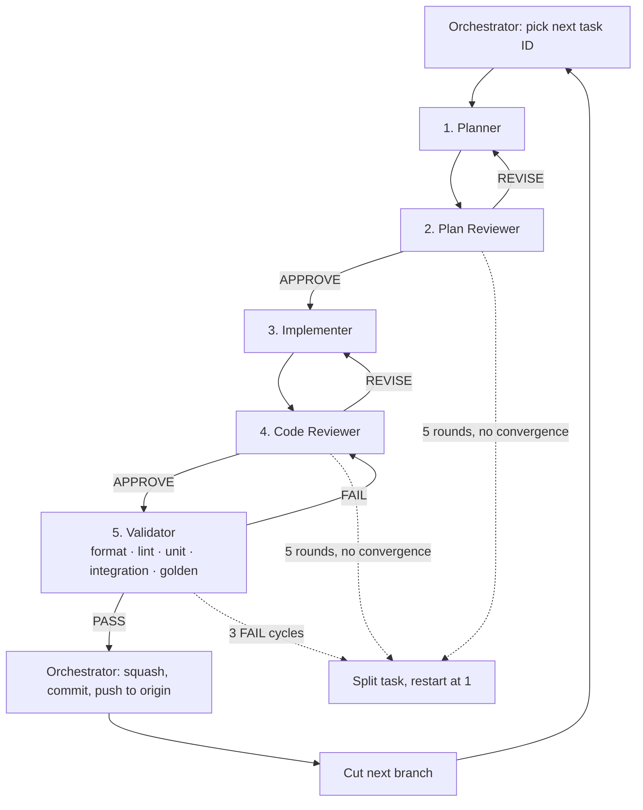

# Android Embedder API Migration — Execution Ledger (v8)

**Companion to:** `MIGRATION_PLAN.md`
**Audience:** engineers and coding agents executing one task at a time

---

## How to use this document

> [!IMPORTANT]
> **If you are an agent assigned a single task: read §A (Rules of Engagement), §D.4.<your role> (your contract), and your one task block. Do not read other task blocks.** Every task block is self-contained by design. If your task appears to require knowledge from another task, that is a bug in this ledger — stop and report it rather than guessing.
>
> **If you are the orchestrator: read §A.2, §D, and §B. Nothing else.** In particular, do not read task blocks, plans, reviews, diffs, or logs. §D.3 explains why that restriction is what makes a ninety-branch stack possible at all.

---

# §A — Rules of Engagement

Read this section once. It applies to every task.

### A.1 The twelve invariants

Check every one before pushing a branch. A "no" on any line means the branch is not ready.

- [ ] **I-1** No silent fallbacks. Nothing returns a plausible default when it cannot do the real thing. Fail loudly or declare the gap.
- [ ] **I-2** No assertion was weakened. No `FML_UNREACHABLE` / `FML_DCHECK` / `FML_CHECK` was removed or softened.
- [ ] **I-3** No pre-existing test was weakened. No sleeps, retries, polling loops, widened timeouts, or rewritten expectations added to make a change pass.
- [ ] **I-4** Behaviour claims are backed by a test that fails before and passes after.
- [ ] **I-5** Any new test target is wired into `testing/run_tests.py` and `ci/builders/*.json` **on this branch**.
- [ ] **I-6** Net test coverage did not decrease.
- [ ] **I-7** Diff is within the applicable cap, excluding generated files, pure deletions, **and tests**: **≤ 3000 lines** for mechanical, tooling, or pure-refactor changes that alter no runtime behaviour; **≤ 1000 lines** for any change that alters rendering or runtime behaviour. Tests are never counted and must never be dropped, shortened, or merged to fit a cap.
- [ ] **I-8** Any new `// nogncheck` has an adjacent `// TODO(b/NNN)`.
- [ ] **I-9** No changes to `shell/common/`, `runtime/`, `lib/ui/`, or non-Android embedders. Those need their own branch and a cross-platform reviewer.
- [ ] **I-10** No Android types, `#if defined(__ANDROID__)`, or NDK headers added under `shell/platform/embedder/`.
- [ ] **I-11** All four composition modes (VD, TLHC, HC, HCPP) and both external texture paths still work. No mode was dropped, stubbed, or "temporarily" disabled. If the task touches composition, the A.3b matrix is filled in and green.
- [ ] **I-12** E2E ran on this branch, on real hardware, in both flag states where the flag exists. Deferring E2E "to the end" is the v7 failure mode.

### A.2 Branch conventions — **this migration creates NO pull requests**

> [!CAUTION]
> **Do not open a pull request. Ever. For any task.** This is a prototype migration. Each task produces one branch, pushed to `origin`. The repository owner will manually open a **single** PR from the **last** branch in the stack when the migration is complete.
>
> Creating a PR — draft or otherwise — is a process violation. If you believe a task needs review before the stack continues, say so in the ledger entry and stop; do not open a PR to force the conversation.

```
Branch:  android-embedder-v8/<task-id>-<slug>
Example: android-embedder-v8/t-0.3-threading-characterization

Commit:  [android-embedder] T-0.3: <one-line summary>
```

> [!IMPORTANT]
> **Who runs these commands matters.** The *Orchestrator* creates the branch. The *Implementer* only makes local `WIP:` commits. Only the *orchestrator* squashes, commits the final message, and pushes — and only after the *Validator* returns `PASS`. See **§D.7** for the exact sequence. An implementer that pushes has bypassed two of the five required agents.

**Stack topology.** Branches form a single linear stack. Each branch is cut from the previous task's branch, **not** from `master`:

```bash
# The root branch (T-0.0) — the only one cut from upstream/master
git fetch upstream && git checkout -b android-embedder-v8/t-0.0-migration-docs upstream/master

# Every subsequent task
git checkout android-embedder-v8/<previous-task-id>-<slug>
git checkout -b android-embedder-v8/<this-task-id>-<slug>

# When the task is verified (see A.5/A.6)
git push origin android-embedder-v8/<this-task-id>-<slug>
```

**The commit message body replaces the PR description.** It must contain, in this order:

1. **Task ID** and a one-paragraph plain-English summary.
2. **Behaviour change: yes / no.** If yes, exactly what a user would observe.
3. **Flag:** `none` or `--android-embedder-api`.
4. **Verification:** the path to the committed verification artifact (A.6) and a one-line result summary.
5. **Invariant checklist** from A.1, filled in.

**Why a diff cap still applies.** The final PR will contain the entire stack. The only thing that makes it reviewable is a clean commit-by-commit history. A 4,000-line commit is unreviewable in a stack of 100 the same way it is unreviewable in a PR — v7's single commits reached +4,606 lines and nobody could audit them.

The cap is **tiered** because review attention is not uniform. A 3,000-line mechanical rename is genuinely reviewable: the reader checks the pattern and spot-checks instances. A 3,000-line change to rendering or threading is not, because every line can carry a behavioural consequence. Hence 3000 for mechanical, tooling, and pure-refactor work; 1000 where runtime behaviour changes.

**Tests are excluded from the count entirely.** An earlier revision of this ledger counted them, and on T-0.15a that produced five consecutive plan revisions in which tests were deferred, thinned, or silently dropped to fit the number — including one attempt to credit deleted lines as negative. A cap that discourages test coverage is worse than no cap. Test volume is never the variable that flexes.

> [!CAUTION]
> **Do not create a branch manifest file.** No `MIGRATION_BRANCHES.md`, no hand-maintained list of branch names or head SHAs, anywhere in the repo or the ledger.
>
> v7 had one. It recorded base `5f91bd97888` and 41 head SHAs, and **every single one was stale** — branches were force-updated underneath it and the file was never corrected. It then became the authority that made the stack look coherent when it was not.
>
> Any transcription of git state into markdown is wrong the moment a branch moves. Branch state is **derived from git, never recorded by hand**:
> - `git branch -r --list 'origin/android-embedder-v8/*'` is the branch list.
> - `dev/tools/bin/migration_verify.dart --audit-stack` (T-0.15) is the authority on stack integrity.
> - `--summary` regenerates §B and §B.1 from committed artifacts rather than from someone's memory.
>
> The same rule applies to the ledger: **§B and §B.1 are generated, not typed.** If you find yourself pasting a SHA into a markdown table by hand, stop — that is the v7 failure mode reappearing in a new file name.

> [!WARNING]
> **The last branch must pass the full gate, not just its own task's gate.** It is the only branch that becomes a PR and the only one CI will ever see. Budget for a complete A.3 + A.3b + A.3c run on the final branch as its own task.

### A.3 Standard verification block

Most tasks reference this. Run from the repo root.

```bash
# --- Native: build and run the Android engine unit tests ---
cd engine/src
ninja -C out/android_debug_unopt_arm64 flutter_shell_native_unittests
cd flutter && ./testing/run_tests.py --type android --android-variant android_debug_unopt_arm64

# --- Java: Robolectric ---
cd engine/src/flutter/shell/platform/android
./gradlew test

# --- Host engine tests (any embedder.h change) ---
cd engine/src
ninja -C out/host_debug_unopt embedder_unittests embedder_proctable_unittests
./out/host_debug_unopt/embedder_unittests
./out/host_debug_unopt/embedder_proctable_unittests

# --- Static analysis and formatting ---
cd engine/src/flutter
./ci/clang_tidy.sh --variant host_debug_unopt
./ci/format.sh

# --- Dependency ratchet (exists after T-0.9) ---
python3 engine/src/flutter/tools/android_embedder_deps.py --check
```

### A.3b Composition conformance matrix — **required at every stage exit**

> [!CAUTION]
> Per **I-11** and **I-12**, this block is **not optional** and **not deferred to the end**. Any task that touches platform view composition, external textures, the compositor, threading, or the surface lifecycle must run it and paste the result. The previous migration deleted all four composition modes and did not notice, because it planned to validate "at the end."

```bash
# Full matrix, both Impeller backends. Requires an attached device.
SHARD=android_engine_vulkan_tests   bin/cache/dart-sdk/bin/dart dev/bots/test.dart
SHARD=android_engine_opengles_tests bin/cache/dart-sdk/bin/dart dev/bots/test.dart

# A single mode while iterating (from dev/integration_tests/android_engine_test):
#   HC
flutter drive lib/platform_view/hybrid_composition_platform_view_main.dart --no-dds
#   TLHC
flutter drive lib/platform_view/texture_layer_hybrid_composition_platform_view_main.dart --no-dds
#   VD
flutter drive lib/platform_view/virtual_display_platform_view_main.dart --no-dds
#   External textures — SurfaceTexture (B-5) and SurfaceProducer
flutter drive lib/external_texture/surface_texture_smiley_face_main.dart --no-dds
flutter drive lib/external_texture/surface_producer_smiley_face_main.dart --no-dds
#   HCPP (needs the manifest meta-data or the flag; Vulkan + API 34 device only)
flutter drive lib/hcpp/platform_view_main.dart --enable-hcpp --no-dds

# Once the migration flag exists, every one of the above runs twice:
#   --android-embedder-api      (new path)
#   --no-android-embedder-api   (legacy path; must match the Stage 0 baseline)
```

**Result table to paste into the ledger entry.** A blank cell is a failure; `n/a` requires a written reason.

| Mode | Vulkan flag-off | Vulkan flag-on | GLES flag-off | GLES flag-on |
|---|---|---|---|---|
| HC | | | | |
| TLHC | | | | |
| VD | | | | |
| HCPP | | | `n/a — Vulkan only` | `n/a — Vulkan only` |
| HCPP→HC/TLHC fallback | `n/a` | `n/a` | | |
| SurfaceTexture ext. | | | | |
| SurfaceProducer ext. | | | | |

### A.3c Devicelab gate — **required at every stage exit**

```bash
# From dev/devicelab. Requires a real device; see the LUCI `led` skill to run in CI.
../../bin/cache/dart-sdk/bin/dart bin/run.dart -t android_views
../../bin/cache/dart-sdk/bin/dart bin/run.dart -t hybrid_android_views_integration_test
../../bin/cache/dart-sdk/bin/dart bin/run.dart -t platform_views_scroll_perf__timeline_summary
../../bin/cache/dart-sdk/bin/dart bin/run.dart -t platform_views_scroll_perf_impeller__timeline_summary
../../bin/cache/dart-sdk/bin/dart bin/run.dart -t platform_views_hcpp_scroll_perf__timeline_summary
../../bin/cache/dart-sdk/bin/dart bin/run.dart -t android_view_scroll_perf__timeline_summary
../../bin/cache/dart-sdk/bin/dart bin/run.dart -t android_lifecycles_test
../../bin/cache/dart-sdk/bin/dart bin/run.dart -t android_choreographer_do_frame_test
../../bin/cache/dart-sdk/bin/dart bin/run.dart -t android_semantics_integration_test
../../bin/cache/dart-sdk/bin/dart bin/run.dart -t android_display_cutout
```

Timeline metrics (`average_frame_build_time_millis`, `90th_percentile_frame_rasterizer_time_millis`, `worst_frame_rasterizer_time_millis`) are compared against the **T-0.12 baseline**. A regression beyond the recorded noise band is a blocking finding, not a flake — re-run three times before claiming flake, and record all three.

### A.4 Task template

Every task below uses this shape:

| Field | Meaning |
|---|---|
| **Depends on** | Tasks that must be merged first. `—` means none. |
| **Flag** | `none` or `--android-embedder-api` |
| **Behaviour change** | Whether a user could observe a difference |
| **Size** | Rough expected diff, for splitting guidance |
| **Reviewer** | Domain expertise the reviewer needs |

**Every task runs the full five-agent pipeline in §D** — Planner → Plan Reviewer → Implementer → Code Reviewer → Validator. The task block below is the *input* to that pipeline, not a substitute for it. A task block never tells you to skip a role, and the **Reviewer** field describes the expertise the Plan Reviewer and Code Reviewer need, not permission to proceed without one.

### A.5 Checking a box — the evidence rule, without CI

> [!CAUTION]
> **Read this twice. The previous migration failed under exactly these conditions.**
>
> v7 was also a branch stack pushed to `origin` with no PRs and no CI. That is precisely how it certified "285/285 tests passed on Google Pixel Tablet 48171HFH80D9S7" on branches (`phase-6.2`, `phase-6.3`) where the vsync JNI natives were unregistered and the app would `UnsatisfiedLinkError` on the first frame. 41 of 42 ledger items were marked complete. None of it was checkable, so none of it was checked.
>
> Removing PRs removes the CI backstop. It does **not** remove the evidence requirement — it makes the evidence requirement the *only* thing standing between this attempt and v7's outcome.

**A checkbox may be ticked only when a committed verification artifact (A.6) exists whose recorded commit SHA matches the branch's actual SHA.**

Not acceptable, in any form:
- "Verified on device."
- "All tests pass."
- "100% confidence."
- Pasted output with no recorded SHA — unattributable to a specific tree state.
- An artifact from an ancestor branch. Each branch verifies itself.

If a gate genuinely cannot be run — no device available, a build is broken upstream — the box stays **unticked** and the ledger entry records why. An honest `[ ]` with a reason is worth more than a `[x]` that nobody can reproduce. A stage may not exit with unticked gate boxes.

### A.6 Verification artifacts and stack staleness

#### The artifact

Every verified task commits `.migration/verification/<task-id>.json` **to its own branch**, plus the raw logs under `.migration/verification/<task-id>/`. Built by `dev/tools/bin/migration_verify.dart` (**T-0.15**).

```jsonc
{
  "task_id": "T-0.3",
  "branch": "android-embedder-v8/t-0.3-threading-characterization",
  "commit_sha": "<git rev-parse HEAD>",      // the tree this ran against
  "parent_sha": "<git rev-parse HEAD~1>",    // for the staleness audit
  "timestamp": "2026-09-15T02:19:05Z",
  "host": { "os": "...", "device": "Pixel Tablet 48171HFH80D9S7", "android": "16" },
  "gates": {
    "native_unittests":  { "ran": true,  "passed": 41, "failed": 0, "log": "native.log" },
    "robolectric":       { "ran": true,  "passed": 120, "failed": 0, "log": "robolectric.log" },
    "composition_matrix":{ "ran": true,  "results": "composition_matrix_results.json" },
    "devicelab":         { "ran": false, "reason": "not a stage boundary" },
    "ratchet":           { "ran": true,  "before": 37, "after": 37 }
  }
}
```

Three properties make this falsifiable in a way v7's prose was not:

1. **It is in git history**, timestamped, on the branch it describes. It cannot be written retroactively without an obvious amend.
2. **It embeds the SHA it ran against.** A mismatch between `commit_sha` and the branch tip is mechanically detectable. This alone would have caught v7's phase-6.2/6.3 fabrications.
3. **`"ran": false` is a first-class, expected value.** There is no incentive to fake a run, because declining to run is a legitimate recorded outcome.

#### Stack staleness — the failure mode specific to branch stacks

> [!WARNING]
> **If you force-update a branch, every verification above it in the stack is invalid.** v7's `MIGRATION_BRANCHES.md` listed 41 head SHAs and **all of them were stale** because branches were force-updated underneath. Its ledger still claimed every phase was certified.

Rules:

- A verification is valid only if its `parent_sha` matches the actual parent commit.
- Rebasing or amending any branch **invalidates every descendant's artifact**. Re-run them, or mark them stale in the ledger. Do not silently carry them forward.
- Prefer appending a fix as a new task branch over amending a verified branch.
- `dev/tools/bin/migration_verify.dart --audit-stack` walks the whole stack and reports every branch whose artifact is missing, stale, or SHA-mismatched. **Run it at every stage boundary and before the final branch.**

#### Where CI still matters

Losing PRs does **not** relax **I-5**. Wiring new test targets into `testing/run_tests.py` and `ci/builders/*.json` is a *code change on the branch*, and it is what makes the eventual single PR actually run these tests. v7's 285-test suite was never wired in — that config gap is independent of whether PRs exist, and T-0.10 still fixes it.

### A.7 The physical device — one agent at a time

A physical Android device is attached to the workstation. It is a **single, non-shareable resource** and the pipeline in §D runs several agents that all want it. Two agents running `flutter drive` against one device do not produce two results; they produce two corrupted results and neither agent can tell.

**Rules:**

1. **Never touch the device without holding the lock.** Every device-using command is wrapped:

   ```bash
   # Preferred: the verify tool takes and releases the lock, and records the serial.
   dart dev/tools/bin/migration_verify.dart --task T-0.3 --gate composition-matrix

   # Direct invocations must use flock explicitly.
   flock /tmp/android-embedder-v8.device.lock -c '
     flutter drive lib/platform_view/hybrid_composition_platform_view_main.dart --no-dds
   '
   ```

   `dev/tools/bin/migration_verify.dart` (T-0.15) owns `/tmp/android-embedder-v8.device.lock`. An agent that cannot acquire the lock **waits**; it does not proceed without the device and it does not report a gate as passed.

2. **Preconditions, checked and recorded before every device gate:**

   ```bash
   adb devices -l          # exactly one device, state 'device' (not 'unauthorized'/'offline')
   adb shell getprop ro.build.version.sdk      # must be >= 34 for any HCPP gate
   adb shell getprop ro.product.model
   adb shell dumpsys deviceidle | head -5      # not dozing
   ```

   If `adb devices` shows zero devices, more than one device, or a non-`device` state, the gate result is `"ran": false` with the reason — **not** a pass, and **not** a silent skip.

3. **The serial goes in the artifact.** `host.device` in every `.migration/verification/<task-id>.json` is the real `adb get-serialno` output, captured programmatically. It is never typed by hand. v7's most damning artifact was a hand-typed serial (`48171HFH80D9S7`) attached to runs that could not have happened.

4. **Leave the device clean.** Every device gate ends with the app uninstalled and logcat cleared, so the next agent's `adb logcat` is attributable:

   ```bash
   adb uninstall dev.flutter.integration_test || true
   adb logcat -c
   ```

5. **HCPP gates require a capable device.** HCPP is Impeller Vulkan + API 34 only (plan §5.0). On a device that does not qualify, the HCPP row is `n/a — device API <N>, Vulkan unsupported` with the captured `getprop` output as evidence, and the **HCPP→HC/TLHC fallback** row becomes mandatory instead.

### A.8 Golden images — compared against the baseline, never regenerated

> [!CAUTION]
> **A locally-built engine may never update a golden file.** Not with `--update-goldens`, not by hand, not "just to unblock." A golden that changes is a **finding**, and findings route back through code review (§D.5), not into the golden.

- Goldens are evaluated against the **committed baseline** captured in **T-0.12** with a stock (unmodified) engine.
- The flag-off leg of every run must reproduce the baseline **byte-for-byte per the harness's comparator**. A flag-off golden diff means the refactor was not behaviour-preserving — that is Stage 2's entire premise failing, and it is a stop-the-branch event.
- The flag-on leg must also match the baseline. The migration's thesis is that the new path is indistinguishable; a flag-on-only golden diff is the migration's most valuable signal and must never be normalised away.
- Variants are keyed by `ANDROID_ENGINE_TEST_GOLDEN_VARIANT`. Do not add a new variant to make a diff disappear; a new variant requires a DR (§E) explaining why the two configurations legitimately render differently.
- If a golden genuinely must change — an upstream framework change landed, say — that is its **own branch**, with its own justification, produced without any migration changes in the tree.


---

# §B — Progress dashboard

> [!IMPORTANT]
> **Generated, not typed.** Regenerate with `dart dev/tools/bin/migration_verify.dart --summary`, which reads the committed verification artifacts. Do not hand-edit these tables and never paste a SHA into them — see the branch-manifest prohibition in §A.2. Counts below are the planned totals until the tool exists (T-0.15).

| Stage | Tasks | Done | Parked | Split | Blocked |
|---|---|---|---|---|---|
| 0 — Pre-Work & Test Hardening | 18 | 0 | 0 | 0 | — |
| 1 — Addressing Gaps | 19 | 0 | 0 | 0 | — |
| 2 — Refactoring & Decoupling | TBD after T-0.6/0.7/0.8/0.13 | 0 | 0 | 0 | — |
| 3 — Adherence | TBD after Stage 2 | 0 | 0 | 0 | — |
| 4 — Flip & Emancipation | 6 | 0 | 0 | 0 | — |

**In-flight task** (exactly one, per §D.7):

| Task | Pipeline stage | Round | Branch | Since |
|---|---|---|---|---|
| — | — | — | — | — |

Pipeline stage is one of `planning` · `plan-review` · `implementing` · `code-review` · `validating` · `pushing`. A task `parked` per §D.7 names the blocking DR; a task `split` per §D.5 names its successors.

## B.1 Composition mode convergence tracker

> [!CAUTION]
> This table is the single most important artifact in the ledger. **Every stage exit updates it.** A mode whose status regresses, or whose test column is not green, blocks the stage. Per **I-11** a mode may never be dropped as collateral of a refactor.

Status values: `legacy` · `embedder-behind-flag` · `embedder-default` · `deprecated (PR link)`

| Mode | Status | Gating tests | Stage 0 baseline | Last verified |
|---|---|---|---|---|
| **VD** — Virtual Display | `embedder-behind-flag` | `platform_view/virtual_display_platform_view_main.dart`; blocked by **B-5** | `PASS` (`8ba18c0bb59`) | T-3.T4 |
| **TLHC** — Texture Layer HC *(default)* | `embedder-behind-flag` | `platform_view/texture_layer_hybrid_composition_platform_view_main.dart` | `PASS` (`8ba18c0bb59`) | T-3.T3 |
| **HC** — Hybrid Composition | `legacy` | `platform_view/hybrid_composition_platform_view_main.dart`, `hybrid_android_views_integration_test`; gated on **T-1.18** (thread merging API extension) | `PASS` (`8ba18c0bb59`) | T-0.12 |
| **HCPP** *(Impeller Vulkan + API 34 only)* | `embedder-behind-flag` | `hcpp/*` (14 mains, Vulkan); GLES fallback test (T-0.11) | `PASS` (`8ba18c0bb59`) | T-3.T5 |
| **SurfaceTexture** ext. texture | `embedder-behind-flag` | `external_texture/surface_texture_smiley_face_main.dart`; blocked by **B-5** | `PASS` (`8ba18c0bb59`) | T-3.T2 |
| **SurfaceProducer/ImageReader** ext. texture | `embedder-behind-flag` | `external_texture/surface_producer_smiley_face_main.dart` | `PASS` (`8ba18c0bb59`) | T-3.T1 |

---

# Stage 0 — Pre-Work & Test Hardening

**Goal:** make the thing being migrated smaller, make its current behaviour observable, and resolve the five unknowns that would otherwise be discovered halfway through Stage 3.

**T-0.0 is the root branch and T-0.15 is branch #2.** Nothing in Stage 2 or later may begin until T-0.0 through T-0.15 are on pushed branches. In particular, T-0.11 (composition conformance harness) and T-0.12 (baseline) are hard prerequisites for *any* refactor: without them there is no signal that a composition mode has stopped working, which is the exact hole v7 fell through.

---

### T-0.0 — Land the plan and the ledger (**the root branch; bootstrap, not pipelined**)

| Field | Value |
|---|---|
| **Depends on** | — |
| **Flag** | none |
| **Behaviour change** | No — documentation only |
| **Size** | ~2,900 lines of markdown, all new files |
| **Reviewer** | n/a — see the bootstrap exception below |

> [!IMPORTANT]
> **This is the only task in the migration that does not run the five-agent pipeline (§D).** The pipeline cannot review the document that defines the pipeline, and a Planner cannot assemble a context pack (§F.2) from a ledger that is not yet in the tree. T-0.0 is the bootstrap: it exists so that every *subsequent* task has something to read.
>
> This exception is narrow and does not generalise. T-0.15 — the very next branch — is fully pipelined, and so is everything after it. An agent that cites T-0.0 as precedent for skipping a role has misread this note.

**Branch:** `android-embedder-v8/t-0.0-migration-docs`, cut from `upstream/master`. Every other branch in the stack descends from it.

**Files added:**

```
docs/platforms/android/embedder-api-migration/
  README.md              # one screen: what this is, where to start, how to run it
  MIGRATION_PLAN.md      # the strategy, invariants, blockers, decision policy
  MIGRATION_LEDGER.md    # this document
  v7-post-mortem.md      # the prior attempt, analysed
.migration/
  README.md              # artifact formats and the §D.6 directory layout
  HUMAN_REVIEW_REQUIRED.md  # empty; §D.9 appends to it
```

**Why `docs/platforms/android/`.** It already holds `Android-Platform-Views.md`, `Hybrid-Composition.md`, `Texture-Layer-Hybrid-Composition.md`, and `Virtual-Display.md` — the four documents describing exactly the subsystems this migration touches. A reader who finds one finds the rest. The subdirectory keeps four large migration documents from burying sixteen existing ones.

**Why the v7 post-mortem ships with them.** §F.2 Part 5 makes "what v7 did here" a mandatory part of every context pack, and §G.9 makes its false-findings list mandatory reading for every Planner. A required input that lives only in an agent's chat history is not a required input. It goes in the tree.

**Rules this branch establishes for its own content:**

1. **The documents are living.** A Planner that finds a §G entry no longer verifying, or a plan section contradicted by the code, **corrects it on its own branch** (§F.2 Part 1, §F.4). These files are not frozen at T-0.0.
2. **§B, §B.1, and §E.3 are generated**, never hand-edited (§A.2). They ship with placeholder rows.
3. **No other file is touched.** No build config, no `CODEOWNERS`, no index page. This branch is the root of a ~100-branch stack; anything controversial in it is controversial in all of them.

**Verify:**

```bash
# Markdown only. Nothing executable changed, so the code gates are n/a with a reason.
git diff --stat upstream/master..HEAD          # only the files listed above
git ls-files -- docs/platforms/android/embedder-api-migration/ .migration/

# No dangling cross-references between the two documents.
grep -ohE '§[A-G](\.[0-9]+(\.[0-9]+)?[a-z]?)?' \
  docs/platforms/android/embedder-api-migration/MIGRATION_{PLAN,LEDGER}.md \
  | sort -u | while read r; do
      sec="${r#§}"
      grep -qE "^#{1,4} (§)?${sec}( |$|—)" \
        docs/platforms/android/embedder-api-migration/MIGRATION_LEDGER.md \
        || echo "DANGLING: $r"
    done

# Every task ID the plan cites exists in the ledger, as a block or a table row.
grep -ohE 'T-[0-4]\.[0-9]+' docs/platforms/android/embedder-api-migration/MIGRATION_PLAN.md \
  | sort -u | while read t; do
      grep -q "$t" docs/platforms/android/embedder-api-migration/MIGRATION_LEDGER.md \
        || echo "MISSING: $t"
    done
```

**Gates:** A.3 `n/a — no code changed`. A.3b/A.3c `n/a — no code changed`. Record both as `"ran": false` with those reasons, per §A.5. Do **not** record them as passed.

---

### T-0.1 — Enumerate and publish the Android embedder test gap

| | |
|---|---|
| **Depends on** | — |
| **Flag** | none |
| **Behaviour change** | No (documentation only) |
| **Size** | ~300 lines of markdown |
| **Reviewer** | Android engine owner |

**Context you need**

Before refactoring the Android embedder we need a written inventory of what is *not* currently tested, with emphasis on thread-sensitive behaviour. On the iOS equivalent of this migration there were large gaps around threading that were only discovered after code had moved. This task produces the inventory that drives T-0.2 … T-0.5.

**Files in scope**

- `engine/src/flutter/docs/android/embedder_test_gaps.md` (new)

**Do**

1. Inventory every test that currently exercises `shell/platform/android`: the `flutter_shell_native_unittests` sources listed in `shell/platform/android/BUILD.gn`, the Robolectric suite under `shell/platform/android/test/`, and the devicelab/integration tests that touch Android.
2. For each of these subsystems, record **tested / partially tested / untested**:
   - Surface lifecycle: `NotifyCreated`, `NotifySurfaceWindowChanged`, `NotifyDestroyed`, and Activity backgrounding/foregrounding
   - Thread creation, affinity, and priority (`AndroidPlatformThreadConfigSetter` in `android_shell_holder.cc`)
   - Dynamic thread merging (`AndroidExternalViewEmbedder::SupportsDynamicThreadMerging`)
   - Platform message thread affinity (`PlatformMessageHandlerAndroid::DoesHandlePlatformMessageOnPlatformThread`)
   - External texture lifetime (`ImageExternalTexture`, `SurfaceTextureExternalTexture`)
   - Vsync and frame pacing (`VsyncWaiterAndroid`)
   - App lifecycle state transitions
   - Viewport metrics: padding, gesture insets, display features, touch slop
   - Semantics/accessibility field coverage
   - Engine spawn / `FlutterEngineGroup`
   - Deferred components
   - `DartCallbackCache` across process restarts
3. For each gap, note whether it is reachable from a host unit test, an on-device unit test, Robolectric, or only E2E.
4. Rank gaps by *(migration risk × current coverage absence)* and mark the top 10.

**Do NOT**

- Write any test in this task. Inventory only.
- Modify any production code.

**Verify**

Document review only. No code changes, so no build required.

**Definition of done**

- [ ] Doc merged at `engine/src/flutter/docs/android/embedder_test_gaps.md`
- [ ] Every subsystem above has an explicit tested/partial/untested verdict
- [ ] Top-10 ranked list present, and each entry maps to a T-0.2 … T-0.5 subtask or an explicit "accepted, not covered" note

**Rollback** — revert the doc.

---

### T-0.2 — Characterization tests: surface lifecycle

| | |
|---|---|
| **Depends on** | T-0.1 |
| **Flag** | none |
| **Behaviour change** | No (tests only) |
| **Size** | ~350 lines |
| **Reviewer** | Android engine owner |

**Context you need**

`PlatformViewAndroid` handles `NotifyCreated` / `NotifySurfaceWindowChanged` / `NotifyDestroyed` as the Android `SurfaceView` appears and disappears across Activity transitions, including GL/Vulkan teardown. The Embedder API has no equivalent concept — it sets a renderer config once at initialize and keeps it for the engine's lifetime. This is one of the three hard blockers (B-2 in the plan). Before anyone redesigns it, we need tests that pin exactly what the current code does, **including any behaviour that looks like a bug** — record it as-is and add a `// CHARACTERIZATION:` comment noting it looks wrong.

**Files in scope**

- `engine/src/flutter/shell/platform/android/platform_view_android_surface_lifecycle_unittests.cc` (new)
- `engine/src/flutter/shell/platform/android/BUILD.gn` — add the new source to `flutter_shell_native_unittests`

**Do**

1. Add tests covering, at minimum:
   - `NotifyCreated` → surface valid, rasterizer able to draw
   - `NotifyDestroyed` → GPU resources released, no use-after-free (run under ASan)
   - `NotifyCreated` → `NotifyDestroyed` → `NotifyCreated` (backgrounding and returning)
   - `NotifySurfaceWindowChanged` mid-frame
   - `NotifyDestroyed` with a frame in flight on the raster thread
   - Double `NotifyCreated` and double `NotifyDestroyed` (idempotency — record actual behaviour)
2. Assert **thread affinity** for each callback using `fml::TaskRunner::RunsTasksOnCurrentThread()`, not just the outcome.
3. Instrument each test with `TRACE_EVENT0("flutter", ...)` so orderings can be diffed in Perfetto later.
4. These tests must pass against **unmodified** `master`. If one fails, you have found a real bug: file it, mark the test `DISABLED_` with the bug number, and report it. Do not fix the bug here.

**Do NOT**

- Change any production code. If a test needs a seam to be written, report that and stop — adding the seam is a separate task.
- Assert behaviour you believe *should* happen. Assert what **does** happen.

**Verify**

Standard block (§A.3), plus:

```bash
cd engine/src
ninja -C out/android_debug_unopt_arm64 flutter_shell_native_unittests
# ASan variant for the teardown tests
ninja -C out/android_debug_unopt_arm64_asan flutter_shell_native_unittests
```

**Definition of done**

- [ ] Tests merged and running in CI (`ci/builders/linux_android_emulator.json`)
- [ ] All six scenarios above covered
- [ ] Thread affinity asserted, not just outcomes
- [ ] Any `DISABLED_` test has a filed bug linked in the PR

**Rollback** — revert; tests only, no production impact.

---

### T-0.3 — Characterization tests: threading, priority, and merging

| | |
|---|---|
| **Depends on** | T-0.1 |
| **Flag** | none |
| **Behaviour change** | No (tests only) |
| **Size** | ~350 lines |
| **Reviewer** | Android engine owner + engine threading owner |

**Context you need**

`AndroidShellHolder` creates threads via `ThreadHost` and sets priorities through `AndroidPlatformThreadConfigSetter` using `setpriority()`. Under the Embedder API this becomes `FlutterCustomTaskRunners::thread_priority_setter`. There is a known discrepancy to pin down: **Android sets the IO thread to `kNormal` while the engine-managed default is `kBackground`.** If we adopt engine-managed threads without noticing, IO thread priority silently changes. Additionally `AndroidExternalViewEmbedder::SupportsDynamicThreadMerging()` returns `true` while the HC++ path returns `false`.

**Files in scope**

- `engine/src/flutter/shell/platform/android/android_threading_unittests.cc` (new)
- `engine/src/flutter/shell/platform/android/BUILD.gn`

**Do**

1. Assert the **actual `setpriority()` value** applied to each of the platform, UI, raster, and IO threads. Record the observed numbers as named constants in the test — these become the parity contract for Stage 3.
2. Assert which thread each of these runs on: vsync callback, platform message dispatch, texture registration, semantics update.
3. Cover dynamic thread merging: `SupportsDynamicThreadMerging()` for `AndroidExternalViewEmbedder`, `AndroidExternalViewEmbedder2`, and `AndroidExternalViewEmbedderWrapper` in both HC++ and non-HC++ modes.
4. Cover the `kMergeAfterLaunch` path: assert merge actually occurs and record when.
5. Emit a Perfetto trace from a representative startup and commit it as a golden reference under `docs/android/` for later comparison.

**Do NOT**

- "Fix" the IO thread priority discrepancy. Record it.
- Change `SupportsDynamicThreadMerging()` — that is T-0.5.

**Verify** — standard block (§A.3).

**Definition of done**

- [ ] Tests merged and running in CI
- [ ] Thread priority constants recorded with a comment marking them as the Stage 3 parity contract
- [ ] All three external view embedder variants covered
- [ ] Golden Perfetto trace committed

**Rollback** — revert.

---

### T-0.4 — Characterization tests: viewport metrics and platform message affinity

| | |
|---|---|
| **Depends on** | T-0.1 |
| **Flag** | none |
| **Behaviour change** | No (tests only) |
| **Size** | ~300 lines |
| **Reviewer** | Android engine owner |

**Context you need**

`FlutterJNI.nativeSetViewportMetrics` passes 30 parameters, including `physicalPadding*`, `systemGestureInset*`, `physicalTouchSlop`, `displayFeatures*`, and `physicalDisplayCornerRadius*`. The Embedder API's `FlutterWindowMetricsEvent` currently has fields for none of those. In the previous migration attempt these were silently dropped, which zeroed `MediaQuery.padding` and `MediaQuery.systemGestureInsets` for every device with a cutout or gesture navigation. This task pins the full set so the loss cannot recur unnoticed. It is also the input to T-1.8.

Separately, `PlatformMessageHandlerAndroid::DoesHandlePlatformMessageOnPlatformThread()` returns `false` while the Embedder API returns `true` (blocker B-3).

**Files in scope**

- `engine/src/flutter/shell/platform/android/android_viewport_metrics_unittests.cc` (new)
- `engine/src/flutter/shell/platform/android/platform_message_affinity_unittests.cc` (new)
- `engine/src/flutter/shell/platform/android/BUILD.gn`

**Do**

1. For **each of the 30 parameters** of `nativeSetViewportMetrics`, add an assertion that a non-default value set from Java arrives intact at `flutter::ViewportMetrics`. One assertion per parameter — do not batch, because a batched assertion will not tell a future reader which field regressed.
2. Add a Robolectric test asserting Java populates each field from the correct Android source (`WindowInsets`, `DisplayCutout`, `ViewConfiguration`, `WindowLayoutInfo`).
3. For platform messages, assert the current thread on which a message from Dart is delivered to the Java handler, both for the default case and for a handler registered on a background `TaskQueue`.
4. Add a `// PARITY CONTRACT:` comment block at the top of each file listing every field covered, so a future agent can diff it against `FlutterWindowMetricsEvent`.

**Do NOT**

- Add fields to `embedder.h` here. That is T-1.8.
- Change the platform message thread affinity. That is decided in T-0.8.

**Verify** — standard block (§A.3), including the Robolectric step.

**Definition of done**

- [ ] All 30 viewport metric parameters individually asserted
- [ ] Robolectric test covering the Java-side population
- [ ] Platform message affinity asserted for default and background queue
- [ ] Parity contract comment blocks present
- [ ] Running in CI

**Rollback** — revert.

---

### T-0.5 — Delete vestigial rendering configuration

| | |
|---|---|
| **Depends on** | T-0.2, T-0.3 |
| **Flag** | none (but user-visible — see below) |
| **Behaviour change** | **Yes** — intentionally removes configurations |
| **Size** | mostly deletions; split into one PR per configuration removed |
| **Reviewer** | Android engine owner + release owner |

**Context you need**

Every configuration that survives into the Embedder API migration must be designed for, tested in both modes, and carried forever. The cheapest migration work is work deleted before it starts. On the iOS migration, vestigial configuration for Skia-vs-Impeller, Metal-vs-software, and three thread-merge modes created significant avoidable work.

`AndroidRenderingAPI` in `android_rendering_selector.h` currently offers `kSoftware`, `kSkiaOpenGLES` (both under `#if !SLIMPELLER`), `kImpellerOpenGLES`, `kImpellerVulkan`, and `kImpellerAutoselect`.

**Files in scope** (per sub-PR)

- `engine/src/flutter/shell/platform/android/android_rendering_selector.h`
- Call sites of any removed enum value
- `shell/platform/android/surface/`, `shell/platform/android/context/` for removed backends
- Release notes / breaking change documentation

**Do**

1. **First**, produce a short written analysis in the PR description for each candidate: who uses it, how it is selected, and what breaks if it is removed. Candidates:
   - `kSoftware` — is it reachable in a shipping configuration, or only a test/emulator fallback?
   - `kSkiaOpenGLES` — is Skia still a supported Android backend?
   - `kImpellerAutoselect` — interacts with blocker B-1; may need to survive.
   - `kMergeAfterLaunch` — **do not delete**; per the design review it stays reachable via the `--merged-platform-ui-thread` engine switch.
2. Remove only the configurations whose analysis shows they are unreachable or formally unsupported.
3. **One configuration per PR.** Each must be independently revertible.
4. Follow the Flutter breaking-change process for anything user-reachable.

**Do NOT**

- Delete `kMergeAfterLaunch` or the `--merged-platform-ui-thread` switch — internal users depend on it and it is explicitly staying on the engine-switch route.
- Bundle multiple removals into one PR.
- Remove anything whose analysis is inconclusive. Leave it and note it in the plan's open questions.

**Verify** — standard block (§A.3), plus full devicelab Android suite for each removal.

**Definition of done**

- [ ] Written analysis for each candidate, merged into `docs/android/embedder_test_gaps.md` or the design doc
- [ ] One PR per removal, each independently revertible
- [ ] Breaking-change process followed where user-reachable
- [ ] Devicelab green

**Rollback** — revert the individual PR.

---

### T-0.6 — SPIKE: resolve the deferred graphics context decision (blocker B-1)

| | |
|---|---|
| **Depends on** | T-0.3 |
| **Flag** | none |
| **Behaviour change** | No (design output only) |
| **Size** | design doc + throwaway prototype |
| **Reviewer** | Impeller owner + Android engine owner + Embedder API owner |

**Context you need**

This is the highest-risk unknown in the migration.

`AndroidContextDynamicImpeller` defers the Vulkan-vs-OpenGL decision until `GetImpellerContext()` is first called — which happens *after* initialization. The Embedder API requires the renderer configuration at `FlutterEngineInitialize`. Worse, `FlutterVulkanRendererConfig` requires the **embedder** to supply `VkInstance` / `VkPhysicalDevice` / `VkDevice` / `VkQueue` plus proc addresses, whereas on Android **Impeller creates them** (see `AndroidContextVKImpeller`).

So there are two mismatches: *when* the decision is made, and *who owns* the resulting objects.

**Files in scope**

- `engine/src/flutter/docs/android/graphics_context_ownership.md` (new)
- A throwaway prototype branch, **not merged**

**Do**

1. Document precisely, with file and line references, how the decision is made today and what each of `AndroidContextDynamicImpeller`, `AndroidContextVKImpeller`, and `AndroidContextGLImpeller` owns.
2. Evaluate at least these three options, each with a prototype sketch, and state pros/cons and risk:
   - **A — Hoist the decision.** Make the GL/VK choice before `FlutterEngineInitialize`. What information is missing at that point, and can it be obtained earlier?
   - **B — Lazy renderer config.** Extend the API so the renderer config can be resolved on the raster thread at first use. Cost: new API surface, affects all embedders.
   - **C — Invert ownership.** Let the embedder adopt an engine/Impeller-created Vulkan context rather than supplying one. Relationship to iOS's needs?
3. Recommend one, with a written rationale.
4. Explicitly state the consequences for `FlutterEngineSpawn` — Chris's comment notes `AndroidContext` appears to be shared between shells, and iOS has an analogous need.

**Do NOT**

- Merge prototype code. The deliverable is a decision.
- Pick option B by default because it is the easiest to write. Growing the shared API is the most expensive long-term choice.

**Verify** — design review with all three named reviewer domains signing off.

**Definition of done**

- [ ] Doc merged with current-state analysis and file/line references
- [ ] All three options evaluated with prototype evidence
- [ ] A recommendation with rationale, signed off by Impeller, Android, and Embedder API owners
- [ ] Spawn/shared-context implications documented
- [ ] Plan's open question #1 answered

**Rollback** — n/a (document).

---

### T-0.7 — SPIKE: renderer availability / surface lifecycle (blocker B-2)

| | |
|---|---|
| **Depends on** | T-0.2 |
| **Flag** | none |
| **Behaviour change** | No (design output only) |
| **Size** | design doc |
| **Reviewer** | Embedder API owner + Android engine owner + **iOS engine owner** |

**Context you need**

The Embedder API has no concept of a rendering surface that comes and goes: the renderer config is set once at `FlutterEngineInitialize` and lives for the engine's lifetime. Android needs `NotifyCreated` / `NotifySurfaceWindowChanged` / `NotifyDestroyed` across Activity and `SurfaceView` transitions, including GL/Vulkan teardown.

iOS has a related concept, `SetGpuAvailability`. The review comments suggest there may be a shared "renderer availability" abstraction worth generalizing. **An iOS owner must be in this review** so the API grows once rather than twice.

**Files in scope**

- `engine/src/flutter/docs/engine/renderer_availability.md` (new)

**Do**

1. Enumerate every Android surface lifecycle transition and what the engine must do at each (teardown order, in-flight frames, resource release, cache invalidation). Use the T-0.2 characterization tests as ground truth.
2. Document iOS's `SetGpuAvailability` semantics and compare.
3. Propose a shared API. Sketch the `embedder.h` addition.
4. Answer explicitly: can the renderer config itself be replaced mid-life, or is availability a separate orthogonal axis?
5. State whether this is one Stage 1 task or several.

**Do NOT**

- Design an Android-only solution without first establishing whether iOS can share it.

**Verify** — design review written to `.migration/plans/`; iOS sign-off handled per **§D.9** (not obtainable in the prototype: prove inertness by test, record `ran: false`, log in `HUMAN_REVIEW_REQUIRED.md`).

**Definition of done**

- [ ] Doc merged
- [ ] iOS owner has signed off in writing
- [ ] Proposed `embedder.h` sketch present
- [ ] Mapped to concrete Stage 1 task(s); this ledger updated
- [ ] Plan's open question #2 answered

**Rollback** — n/a.

---

### T-0.8 — SPIKE: platform message thread affinity (blocker B-3)

| | |
|---|---|
| **Depends on** | T-0.4 |
| **Flag** | none |
| **Behaviour change** | No (design output only) |
| **Size** | design doc |
| **Reviewer** | Embedder API owner + Android engine owner + iOS engine owner |

**Context you need**

`PlatformMessageHandlerAndroid::DoesHandlePlatformMessageOnPlatformThread()` returns `false`. `PlatformMessageHandlerIos` also returns `false`. The Embedder API's implementation in `platform_view_embedder.cc` returns `true`. Adopting the API naively would change which thread platform messages are handled on for every Android app — a broad and subtle behaviour change.

Separately, Flutter documents [background-thread channel handlers](https://docs.flutter.dev/platform-integration/platform-channels#executing-channel-handlers-on-background-threads), which have no Embedder API equivalent.

**Files in scope**

- `engine/src/flutter/docs/engine/platform_message_threading.md` (new)

**Do**

1. Document what `false` buys Android today and what would break if it became `true`. Use the T-0.4 tests as evidence.
2. Do the same for iOS, since it has the identical mismatch.
3. Evaluate: (a) Android conforms to `true`; (b) the API grows a knob; (c) the API's default changes to `false`.
4. Separately address background `TaskQueue` handlers: what does the API need?
5. Recommend, with rationale.

**Do NOT**

- Assume conformance is free. Measure it with the T-0.4 tests.

**Verify** — design review written to `.migration/plans/`; iOS sign-off handled per **§D.9**.

**Definition of done**

- [ ] Doc merged with evidence from T-0.4
- [ ] Three options evaluated; one recommended
- [ ] Background TaskQueue handlers addressed
- [ ] iOS owner signed off
- [ ] Plan's open question #3 answered

**Rollback** — n/a.

---

### T-0.9 — Dependency ratchet tooling

| | |
|---|---|
| **Depends on** | — |
| **Flag** | none |
| **Behaviour change** | No |
| **Size** | ~250 lines |
| **Reviewer** | Android engine owner + infra |

**Context you need**

The end goal is for `shell/platform/android` to depend only on `//flutter/fml`, `//flutter/assets`, `//flutter/common`, and `embedder.h`. The previous attempt enforced this with a separate quarantined GN target, which forced a parallel rewrite. Instead we measure the real target continuously and forbid regressions — progress stays visible and relapse is impossible, without a second build target.

**Files in scope**

- `engine/src/flutter/tools/android_embedder_deps.py` (new)
- `engine/src/flutter/tools/android_embedder_deps_baseline.json` (new)
- CI wiring

**Do**

1. Write a script that reports, for every target in `shell/platform/android/BUILD.gn` and its subdirectory `BUILD.gn` files:
   - internal-engine GN deps (anything `//flutter/*` outside the allowed four)
   - internal-engine `#include`s in the target's sources
   - the count of `// nogncheck` occurrences
2. `--check` mode compares against the committed baseline and **exits non-zero if any count increases**.
3. `--update-baseline` regenerates it; PRs that lower a count must include the regenerated baseline.
4. Emit a human-readable table so a reviewer can see exactly which dependency moved.
5. Wire `--check` into the Android CI builder.

**Do NOT**

- Fail on the *existing* count. The baseline is a ratchet, not a gate on current state.
- Attempt to remove any dependency in this task.

**Verify**

```bash
python3 engine/src/flutter/tools/android_embedder_deps.py --check    # passes on master
# sanity: add a throwaway dep, confirm non-zero exit, then remove it
```

**Definition of done**

- [ ] Script merged, baseline committed
- [ ] `--check` runs in Android CI and is required
- [ ] Verified to fail when a dependency is added
- [ ] Baseline counts quoted in the PR description (these are the numbers the migration drives to zero)

**Rollback** — revert; remove the CI step.

---

### T-0.10 — CI: make the Android embedder test story real

| | |
|---|---|
| **Depends on** | T-0.2, T-0.3, T-0.4 |
| **Flag** | none |
| **Behaviour change** | No |
| **Size** | ~150 lines of config |
| **Reviewer** | Infra + Android engine owner |

**Context you need**

The previous migration's entire verification story rested on a test suite that was never wired into CI and ran only on one engineer's device. That cannot recur. This task establishes the CI contract **before** the migration produces anything that needs verifying.

**Files in scope**

- `engine/src/flutter/testing/run_tests.py`
- `engine/src/flutter/ci/builders/linux_android_emulator.json`
- `engine/src/flutter/ci/builders/*.json` as needed

**Do**

1. Confirm `flutter_shell_native_unittests` runs in CI and now includes the T-0.2/0.3/0.4 sources.
2. Add an ASan Android variant for the surface lifecycle and texture teardown tests.
3. Add the T-0.9 dependency ratchet as a required check.
4. Document in `docs/android/` exactly which builders run which Android test targets, so any future task can point at the right one.
5. Add a CI step that fails if a new `executable(...)` target appears in `shell/platform/android/BUILD.gn` without a corresponding entry in `run_tests.py`. This directly prevents the v7 failure mode.

**Do NOT**

- Create new test targets here. Wire up existing ones.

**Verify** — run each new check locally and capture it in the T-0.10 verification artifact; deliberately break one and show it fails. Note that the checks themselves cannot execute in CI until the final PR is opened, so the artifact is the only evidence — see A.5.

**Definition of done**

- [ ] All Android test targets confirmed running in CI, with run links
- [ ] ASan variant running
- [ ] Ratchet is a required check
- [ ] Orphan-target check active and demonstrated to fail correctly
- [ ] Builder→target mapping documented

**Rollback** — revert config.

---

### T-0.11 — Composition conformance harness: all four modes, every supported backend, both flag states

| Field | Value |
|---|---|
| **Depends on** | — |
| **Flag** | none |
| **Behaviour change** | No (test infrastructure only) |
| **Size** | ~250 lines |
| **Reviewer** | Android platform views + infra |

> [!CAUTION]
> This is the task that directly prevents the v7 catastrophe. v7 deleted `external_view_embedder.cc`, `external_view_embedder_2.cc`, `surface_pool.cc`, `surface_texture_external_texture.cc`, `image_external_texture.cc`, and 1,848 lines of their tests, and ended with **zero** `FlutterCompositor` references in the Android embedder. No CI signal fired, because the tests were deleted alongside the code and the suite was never wired into a builder.

**Context.** The tests already exist. What does not exist is a harness that *fails loudly when a mode stops being exercised*.

Read first:
- [`dev/bots/suite_runners/run_android_engine_tests.dart`](file:///usr/local/google/home/boetger/src/flutter/dev/bots/suite_runners/run_android_engine_tests.dart) — the existing runner
- `dev/integration_tests/android_engine_test/README.md`
- `dev/integration_tests/android_engine_test/lib/hcpp/README.md`

**Current behaviour to preserve:** the runner globs `lib/**_main.dart`, rewrites `AndroidManifest.xml` to select the Impeller backend, runs non-HCPP mains on both backends, and runs HCPP mains **only on Vulkan**, toggling the manifest meta-data `io.flutter.embedding.android.EnableHcpp` and the `--enable-hcpp` / `--no-enable-hcpp` flags. Goldens are keyed by the `ANDROID_ENGINE_TEST_GOLDEN_VARIANT` environment variable.

**Work:**

1. Introduce an explicit mode registry rather than relying on path globbing:
   ```dart
   enum CompositionMode { virtualDisplay, textureLayerHybrid, hybrid, hcpp, surfaceTexture, surfaceProducer }
   ```
   Map each mode to its `_main.dart` files by explicit list. **Do not infer from the path.** An explicit list is what makes a deletion a compile error instead of a silent skip.

2. **Assert non-empty.** If any `CompositionMode` resolves to zero test mains, or zero of its mains ran, fail the shard with a message naming the mode. This single assertion is the defence against I-11 violations.

3. **Encode the HCPP Vulkan-only constraint explicitly — do not lift it.** HCPP structurally requires Impeller Vulkan + API 34: both `AndroidExternalViewEmbedderWrapper::EnsureInitialized()` (L33–36) and `PlatformViewAndroid::IsSurfaceControlEnabled()` (L558–565) check `RenderingApi() == AndroidRenderingAPI::kImpellerVulkan && ContextVK::Cast(...).GetShouldEnableSurfaceControlSwapchain()`, gated on `android_meets_hcpp_criteria_` (`enable_surface_control` && API ≥ `kMinAPILevelHCPP` (34) && `enable_impeller`). Replace the bare `if (impellerBackend == ImpellerBackend.vulkan)` with a declared `unsupported(reason: ...)` registry entry so the skip is self-documenting.

   **Then add the missing coverage: the GLES fallback.** When an app requests HCPP on OpenGLES it falls back to HC/TLHC, and that path has no test — `upgrade_legacy_pv_types_main.dart`, `hc_errors_with_hcpp_enabled.dart`, and `tlhc_with_fallback_to_hc_errors_with_hcpp_enabled.dart` are all Vulkan-only today. Add a GLES variant asserting the fallback resolves to the expected mode. A silently-degrading fallback is precisely the failure class this harness exists to catch.

4. Add a flag axis parallel to the existing `useHCPPFlag` pattern, driven by an `androidEmbedderApi` parameter that emits `--android-embedder-api` / `--no-android-embedder-api`. It is inert until T-1.x creates the flag; land the plumbing now so no later task has an excuse to skip it.

5. Emit a machine-readable summary (`composition_matrix_results.json`) with one row per `(mode, backend, flagState)` so the B.1 tracker can be updated mechanically rather than by hand.

**Verify:**
```bash
SHARD=android_engine_vulkan_tests   bin/cache/dart-sdk/bin/dart dev/bots/test.dart
SHARD=android_engine_opengles_tests bin/cache/dart-sdk/bin/dart dev/bots/test.dart

# Prove the guard works: temporarily rename one main and confirm a NAMED failure.
git mv dev/integration_tests/android_engine_test/lib/platform_view/virtual_display_platform_view_main.dart /tmp/
SHARD=android_engine_vulkan_tests bin/cache/dart-sdk/bin/dart dev/bots/test.dart  # MUST fail, naming virtualDisplay
git mv /tmp/virtual_display_platform_view_main.dart dev/integration_tests/android_engine_test/lib/platform_view/
```

**Done when:**
- [ ] Explicit mode registry; no path-glob inference
- [ ] Empty-mode assertion **demonstrated to fail**, with the failing output pasted in the PR
- [ ] HCPP's Vulkan-only constraint declared via `unsupported(reason: ...)`, not a bare conditional
- [ ] GLES HCPP→HC/TLHC fallback test added and passing
- [ ] Flag axis plumbed (inert until the flag exists)
- [ ] `composition_matrix_results.json` emitted
- [ ] Both shards green in CI, links in the ledger entry

**Rollback** — revert; no production code touched.

---

### T-0.12 — Capture the Stage 0 baseline

| Field | Value |
|---|---|
| **Depends on** | T-0.11 |
| **Flag** | none |
| **Behaviour change** | No |
| **Size** | Documentation only |
| **Reviewer** | Android |

**Purpose.** Every later stage compares against this. Without it, "no regression" is unfalsifiable — which is how v7 certified 285 passing tests that never ran.

**Work:**

1. On **unmodified** `upstream/master`, run A.3b and A.3c in full.
2. Record in `docs/android/embedder_migration_baseline.md`:
   - The exact commit SHA.
   - Device model and Android version for every run.
   - Pass/fail for all 21 integration mains × 2 backends.
   - Timeline metrics for each devicelab task: `average_frame_build_time_millis`, `90th_percentile_frame_rasterizer_time_millis`, `worst_frame_rasterizer_time_millis`.
   - **Three runs of each perf task**, so the noise band is measured rather than guessed.
   - Any test that is *already* failing or flaky, explicitly marked known-bad with a bug link.
3. Populate the **Stage 0 baseline** column of the B.1 tracker.

**Done when:**
- [ ] `docs/android/embedder_migration_baseline.md` committed
- [ ] Noise band recorded for every perf metric (3 runs)
- [ ] Pre-existing failures enumerated with bug links
- [ ] B.1 tracker baseline column populated

---

### T-0.13 — SPIKE: design the thread merging API extension (blocker B-4, **direction decided**)

| Field | Value |
|---|---|
| **Depends on** | T-0.3 (threading characterization), T-0.12 |
| **Flag** | none |
| **Behaviour change** | No — spike, produces a design document |
| **Size** | Document + throwaway prototype |
| **Reviewer** | Chris Bracken or another engine threading owner |

> [!IMPORTANT]
> **The direction is already decided: extend the Embedder API. HC must be supported.** This task does **not** re-litigate that. Its job is to produce a C-ABI specification precise enough that T-1.18 is an implementation task with no open questions.

**The problem, verified in tree:**

| Implementation | `SupportsDynamicThreadMerging()` |
|---|---|
| `ExternalViewEmbedder` (base) | `false` — [embedded_views.cc:55](file:///usr/local/google/home/boetger/src/flutter/engine/src/flutter/flow/embedded_views.cc#L55) |
| `AndroidExternalViewEmbedder` (**HC**) | **`true`** — [external_view_embedder.cc:284](file:///usr/local/google/home/boetger/src/flutter/engine/src/flutter/shell/platform/android/external_view_embedder/external_view_embedder.cc#L284) |
| `AndroidExternalViewEmbedder2` (HCPP) | `false` |
| `IOSExternalViewEmbedder` | `false` |
| `EmbedderExternalViewEmbedder` | **no override** → `false`; also **no `PostPrerollAction` override** |

**The four load-bearing merger call sites in HC** (read these first — they define the API surface):

| Site | Lines | Behaviour |
|---|---|---|
| `SupportsDynamicThreadMerging` | 284–286 | Returns `true`; makes `Rasterizer::Setup` create the merger |
| `PostPrerollAction` | 188–213 | Not merged + has platform layers → `CancelFrame()`, `MergeWithLease(10)`, `kSkipAndRetryFrame`. Merged → `ExtendLeaseTo(10)`. First frame with views → `kResubmitFrame` |
| `BeginFrame` | 233–240 | `FlutterViewBeginFrame()` only `if (merger->IsOnPlatformThread())` |
| `EndFrame` | 273–281 | `RecycleLayers()`, then `FlutterViewEndFrame()` under the same guard |

`kDefaultMergedLeaseDuration = 10` (frames), defined in both `external_view_embedder.h:93` and `external_view_embedder_2.h:100`.

**Work — answer each question with evidence, not reasoning:**

1. **Measure the cost of getting it wrong.** On a scratch branch, force `AndroidExternalViewEmbedder::SupportsDynamicThreadMerging()` to `false` and run the HC tests, `hybrid_android_views_integration_test`, and `platform_views_scroll_perf__timeline_summary`. **Capture Perfetto traces and screenshots.** This establishes what the new API must protect against, and gives T-1.18 a regression test target. It is a hypothesis under test, not an assumption.

2. **Characterize lease behaviour in practice.** Instrument `RasterThreadMerger` and measure over a real scroll with platform views: how often does merge/unmerge actually toggle? Does the 10-frame lease repeatedly expire and re-merge, or does it stay merged? This determines whether the API needs to expose the lease term at all, or whether a simpler "request merged for this frame" primitive suffices. **Do not guess — the answer changes the API shape.**

3. **Validate the proposed C-ABI** in plan §B-4 against the measurements. Specifically resolve:
   - Is exposing `MergeWithLease` / `ExtendLeaseTo` with a frame count the right abstraction, or should the engine own the lease policy and the embedder merely request merging?
   - What is the lifetime contract on `FlutterRasterThreadMergerRef`? (Proposed: valid only for the duration of the callback. Confirm that HC never retains it — audit the four call sites.)
   - Should `begin_frame` / `end_frame` expose the full merger handle, or only a `bool is_on_platform_thread`? The latter is a narrower contract and harder to misuse.
   - What happens if an embedder sets `supports_dynamic_thread_merging = true` but supplies no `post_preroll_callback`? (Proposed: initialization error, per I-1 — no silent fallback.)

4. **Check the interaction with `--merged-platform-ui-thread`.** `kMergeAfterLaunch` already exists in `switches.cc`, and Android generates switches from the manifest in `FlutterLoader.ensureInitializationComplete`. Document how a statically merged configuration and dynamic merging compose — this is a real source of confusing states and Loïc flagged that Android has internal users of that mode.

5. **Cross-platform review.** iOS, macOS, and Windows all supply compositors and all currently get `false`. Confirm the addition is inert for them (zero-initialisation gives `false`) and get sign-off from an owner of each.

6. **Specify the non-Android test** that T-1.18 will ship: a host-side `embedder_unittests` case that drives merge/unmerge through the public API. Per Loïc, no in-tree embedder-API embedder implements platform views, so this test is new ground and closes a real coverage gap.

**Deliverable:** `docs/android/embedder_migration_b4_thread_merging.md` containing the **final C-ABI**, signed off by an engine threading owner plus one owner each from iOS/macOS/Windows.

**Done when:**
- [ ] Unmerged-HC prototype run, with traces and screenshots attached
- [ ] Lease toggle frequency measured over a real scroll
- [ ] All four questions in (3) resolved with a written rationale
- [ ] `--merged-platform-ui-thread` interaction documented
- [ ] Cross-platform inertness **proven by test** — existing `embedder_unittests` green on iOS/macOS/Windows configurations, zero-initialised field yields the pre-change behaviour
- [ ] Cross-platform sign-off — `ran: false` + entry in `.migration/HUMAN_REVIEW_REQUIRED.md` per §D.9 (stays unticked in the prototype)
- [ ] Final C-ABI in the doc, precise enough to implement without further design
- [ ] Non-Android test specified

---

### T-0.14 — External texture inventory (blocker B-5)

| Field | Value |
|---|---|
| **Depends on** | — |
| **Flag** | none |
| **Behaviour change** | No |
| **Size** | Document |
| **Reviewer** | Android graphics |

**Context.** VD and TLHC are *texture* modes, not compositor modes. v7 deleted both implementations and replaced `RegisterSurfaceTexture` with a `std::map` insert that never creates an engine texture — silently breaking VD and every plugin built on the public `TextureRegistry.createSurfaceTexture()` API (`video_player`, `camera`, `webview_flutter`, `google_maps_flutter`).

**Work.** For each of the six implementations below, document what it needs from the engine and whether `FlutterOpenGLTexture` / `FlutterVulkanTexture` can express it:

| Implementation | File |
|---|---|
| `SurfaceTextureExternalTextureGLSkia` | `surface_texture_external_texture_gl_skia.cc` |
| `SurfaceTextureExternalTextureGLImpeller` | `surface_texture_external_texture_gl_impeller.cc` |
| `SurfaceTextureExternalTextureVKImpeller` | `surface_texture_external_texture_vk_impeller.cc` |
| `ImageExternalTextureGLSkia` | `image_external_texture_gl_skia.cc` |
| `ImageExternalTextureGLImpeller` | `image_external_texture_gl_impeller.cc` |
| `ImageExternalTextureVKImpeller` | `image_external_texture_vk_impeller.cc` |

For each, record:
- The JNI calls it depends on (`SurfaceTextureAttachToGLContext`, `SurfaceTextureUpdateTexImage`, `SurfaceTextureGetTransformMatrix`, `ImageProducerTextureEntryAcquireLatestImage`, `ImageGetHardwareBuffer`, `HardwareBufferClose`, …) — see [`platform_view_android_jni.h`](file:///usr/local/google/home/boetger/src/flutter/engine/src/flutter/shell/platform/android/jni/platform_view_android_jni.h).
- Whether the Embedder API can express it today. Pay particular attention to the **UV transform matrix** (`SurfaceTextureGetTransformMatrix` returns an `SkM44`) — Chris flagged *"no uv transform matrix iirc"*.
- The `GL_TEXTURE_EXTERNAL_OES` target requirement.
- Image LRU / lifetime semantics (`image_lru.cc`).

Also enumerate the **Java-side** public surface that must keep working: `TextureRegistry.createSurfaceTexture()`, `createSurfaceProducer()`, `createImageTexture()`, and `SurfaceProducer.Callback`.

**Deliverable:** `docs/android/embedder_external_texture_gaps.md`, with a table whose rows become Stage 1 tasks (seeding gap 1.19).

**Done when:**
- [ ] All six implementations analysed
- [ ] UV transform matrix gap explicitly resolved (supported / needs API / needs workaround)
- [ ] Public Java `TextureRegistry` surface enumerated
- [ ] Gap rows filed as Stage 1 tasks

---

### T-0.15a — Verification tooling core and artifacts

| Field | Value |
|---|---|
| **Task ID and title** | T-0.15a — Verification tooling core and artifacts |
| **Goal, one sentence** | Create the core verification JSON schema, dependency-injected execution/filesystem validators, and `--check-artifact-sha` pipeline completeness check. |
| **Depends on** | T-0.0 |
| **Flag** | none |
| **Behaviour change: yes/no** | No |
| **Anchor** | `dev/tools/bin/migration_verify.dart` |
| **Composition impact** | none — tooling only |

### T-0.15b — Stack audit and device lock

| Field | Value |
|---|---|
| **Task ID and title** | T-0.15b — Stack audit and device lock |
| **Goal, one sentence** | Implement across-branch history checking (`--audit-stack`) and exclusive hardware lock (`--device-lock`). |
| **Depends on** | T-0.15a |
| **Flag** | none |
| **Behaviour change: yes/no** | No |
| **Anchor** | `dev/tools/bin/migration_verify.dart` |
| **Composition impact** | none — tooling only |

> [!CAUTION]
> **This is the first *code* branch in the stack — cut from T-0.0, ahead of T-0.1.** Every other task's evidence depends on it. Without it there is no mechanism to tick a box, and the migration is running blind in exactly the way v7 did.
>
> It is also the first branch to run the full five-agent pipeline (§D). T-0.0 was the bootstrap exception; this one is not.

**Build `dev/tools/bin/migration_verify.dart`.** Dart, per repository convention; parallelise independent gates across isolates since the native build, Robolectric, and analysis steps are independent.

**Subcommands:**

| Command | Behaviour |
|---|---|
| `--task <id>` | Runs the gates appropriate to the task, writes `.migration/verification/<id>.json` + raw logs |
| `--gates <list>` | Explicit gate selection: `native,robolectric,host,analysis,ratchet,matrix,devicelab` |
| `--audit-stack` | Walks the branch stack; reports missing, stale, or SHA-mismatched artifacts |
| `--summary` | Regenerates the §B dashboard, the §B.1 tracker, and the §E.3 decision index from committed artifacts |
| `--check-artifact-sha --task <id>` | Asserts the artifact's `commit_sha` equals the current branch tip. Run after the orchestrator squashes (§D.7), because squashing changes the SHA |
| `--device-lock -- <cmd>` | Acquires `/tmp/android-embedder-v8.device.lock`, records `adb get-serialno` and the §A.7 preconditions, runs `<cmd>`, releases the lock, and cleans the device |

**Requirements:**

1. **Always record `commit_sha` and `parent_sha`** from `git rev-parse`. Never accept them as arguments — reading them from the actual repository is the whole anti-fabrication mechanism.
2. **Refuse to run on a dirty tree** unless `--allow-dirty` is passed, and if it is, record `"dirty": true` in the artifact. A verification of uncommitted code is not a verification of the branch.
3. **`"ran": false` with a `reason` is a valid, first-class outcome.** Never infer, default, or interpolate a result. Per I-1, a gate that did not run is recorded as not having run.
4. **Exit non-zero if any gate that ran failed.** The tool is usable as a pre-push hook.
5. `--audit-stack` reports, per branch: artifact present? `commit_sha` == branch tip? `parent_sha` == actual parent? Any descendant invalidated by a rebase?
6. Emit both JSON and a human-readable markdown block that pastes directly into a §C ledger entry.
7. **Own the device lock (§A.7).** Acquire before any hardware gate; block (do not fail, do not skip) while another agent holds it; release on every exit path including signals. Capture the serial from `adb get-serialno` **programmatically** — the tool must make a hand-typed serial impossible, which is precisely the fabrication v7 committed.
8. **Never pass `--update-goldens`, and never write to a golden file** (§A.8). If the harness offers the flag, the tool must not expose it. A golden diff is reported as a gate failure.
9. **Enforce the pipeline.** `--check-artifact-sha` fails if `.migration/plans/<id>.plan.md`, at least one approved `plan-review-*.md`, and at least one approved `code-review-*.md` are not present on the branch. A branch that skipped an agent is mechanically detectable, and §D.1 says it is invalid.

**Also add** `.migration/README.md` explaining the artifact format and the §D.6 directory layout, so a fresh agent with no context can interpret one.

**Verify:**
```bash
dart analyze --fatal-infos dev/tools/bin/migration_verify.dart
dart format dev/tools/bin/migration_verify.dart

# Self-verification: the tool must verify its own branch.
dart dev/tools/bin/migration_verify.dart --task T-0.15 --gates analysis
cat .migration/verification/T-0.15.json

# Prove the SHA check works — this is the control that would have caught v7.
python3 -c "
import json,pathlib
p=pathlib.Path('.migration/verification/T-0.15.json')
d=json.loads(p.read_text()); d['commit_sha']='0'*40; p.write_text(json.dumps(d))"
dart dev/tools/bin/migration_verify.dart --audit-stack   # MUST report a SHA mismatch and exit non-zero
git checkout .migration/verification/T-0.15.json

# Prove the dirty-tree guard works.
echo "scratch" >> README.md
dart dev/tools/bin/migration_verify.dart --task T-0.15 --gates analysis   # MUST refuse
git checkout README.md

# Prove the device lock actually serializes. Two concurrent holders would mean
# two agents driving one device and neither able to tell (§A.7).
dart dev/tools/bin/migration_verify.dart --device-lock -- sleep 10 &
sleep 1
time dart dev/tools/bin/migration_verify.dart --device-lock -- true   # MUST block ~9s, not fail
wait

# Prove the pipeline check works: a branch with no review artifacts is invalid.
dart dev/tools/bin/migration_verify.dart --check-artifact-sha --task T-0.15  # MUST name the missing artifacts
```

**Done when:**
- [ ] `dart analyze --fatal-infos` clean; `dart format` applied
- [ ] Artifact schema matches A.6
- [ ] SHA-mismatch detection **demonstrated to fail**, output pasted in the commit body
- [ ] Dirty-tree guard **demonstrated to refuse**, output pasted
- [ ] `--audit-stack` works on a stack of at least two branches
- [ ] `"ran": false` round-trips correctly and does not count as a pass
- [ ] `.migration/README.md` written
- [ ] Branch pushed to `origin`; **no PR opened**

**Rollback** — delete the branch; nothing depends on it yet.

---

# Stage 1 — Addressing Gaps

**Goal:** extend `embedder.h` until it can express everything Android needs. Purely additive; no Android code changes here.

### Rules for every Stage 1 task

Read these once; they apply to all of T-1.x and are not repeated per task.

1. **Append only.** Never insert into or reorder an existing struct. Never make a struct member conditionally compiled.
2. **`SAFE_ACCESS`, never `struct_size < sizeof(...)`.** A hard size comparison breaks every embedder compiled against an older header the moment a field is appended.
3. **Info-struct pattern** for new entry points: one versioned `const Flutter*Info*` argument, not a positional list.
4. **Bump `FLUTTER_ENGINE_VERSION`** when the ABI grows.
5. **Append proc-table entries at the end** of `FlutterEngineProcTable` and extend `embedder_unittests_proctable.cc`.
6. **No Android.** No Android types, no `#if defined(__ANDROID__)`, no NDK headers in `shell/platform/embedder/`. Opaque handles only.
7. **Ship a non-Android test.** Every task adds coverage to `embedder_unittests` that runs on the host. An API with only an Android consumer will rot.
8. **Document the calling thread** for every new callback in the header doc comment.
9. **Ownership must be explicit** in the doc comment: who allocates, who frees, and when, for every pointer and file descriptor.
10. **Update `mock_engine.cc`** for other embedders if the proc table changes — and make the mock do something observable, not `return kSuccess`.

| Task | Gap | Depends on | Shared with iOS? |
|---|---|---|---|
| **T-1.1** | Renderer config `setup_callback` (replaces `SetupImpellerContext`) | T-0.6 | Likely |
| **T-1.2** | Renderer availability / surface lifecycle | T-0.7 | **Yes — iOS review required** |
| **T-1.3** | Custom asset resolver (`FlutterAssetResolver`, `FlutterMapping`) + hot-restart `UpdateAssetResolverByType` | — | Possibly |
| **T-1.4** | Dart deferred components | — | Possibly |
| **T-1.5** | Semantics node fields | — | **Yes** |
| **T-1.6** | Pointer data: tilt, orientation, radius, pressure | — | **Yes** |
| **T-1.7** | `SetApplicationLocale` | — | **Yes** |
| **T-1.8** | Window metrics: padding, gesture insets, touch slop, display features, corner radius | T-0.4 | Likely |
| **T-1.9** | Vulkan external textures + backing-store render targets | T-0.6 | Possibly |
| **T-1.10** | OpenGL: UV transform matrix, platform views on GLES | — | **Yes** |
| **T-1.11** | `FlutterEngineSpawn` (info-struct, `initial_route`, shared context) | T-0.6 | Possibly |
| **T-1.12** | Custom task runners + thread priority setter | T-0.3 | Possibly |
| **T-1.13** | Background-thread platform channel handlers | T-0.8 | **Yes** |
| **T-1.14** | Engine-independent Dart callback cache | — | No |
| **T-1.15** | **Screenshot in Android platform code (not the API)** | — | No |
| **T-1.16** | Non-linear font scaling callback | — | **Yes** |

Three tasks are specified in full below because they carry the most risk of being done wrong. The remainder follow the same template and the Stage 1 rules above; expand each to a full block before assigning it.

---

### T-1.5 — Semantics node field gaps

| | |
|---|---|
| **Depends on** | — |
| **Flag** | none |
| **Behaviour change** | No (additive) |
| **Size** | ~350 lines |
| **Reviewer** | Embedder API owner + accessibility owner + iOS owner |

**Context you need**

`FlutterSemanticsNode2` is missing fields the Android `AccessibilityBridge` needs. Identified in design review: `maxValueLength`, `currentValueLength`, `traversalParent`, `hitTestTransform`, `role`, `linkUrl`, `locale`, `minValue`, `maxValue`. The previous migration attempt worked around this by hardcoding `maxValueLength = 0` and `traversalParent = -1` in the Android mapper, which silently degrades TalkBack traversal order and editable-field announcements. Desktop embedders needed the same plumbing.

Compare `SemanticsNode` in `lib/ui/semantics.dart` and `AccessibilityBridge.java` against `embedder.h` to produce the authoritative missing list — do not rely on the list above being complete.

**Files in scope**

- `engine/src/flutter/shell/platform/embedder/embedder.h`
- `engine/src/flutter/shell/platform/embedder/embedder.cc`
- `engine/src/flutter/shell/platform/embedder/embedder_semantics_update.cc`
- `engine/src/flutter/shell/platform/embedder/tests/embedder_a11y_unittests.cc`

**Do**

1. Diff `flutter::SemanticsNode` against `FlutterSemanticsNode2` and list **every** unmapped field in the PR description.
2. Append the missing fields to `FlutterSemanticsNode2`. Append only.
3. Populate them in `embedder_semantics_update.cc`, guarded by `SAFE_ACCESS`.
4. Add host tests in `embedder_a11y_unittests.cc` asserting each new field round-trips a non-default value. One assertion per field.
5. Bump `FLUTTER_ENGINE_VERSION`.
6. Document ownership and lifetime for `linkUrl` and `locale` (string lifetime across the callback boundary).

**Do NOT**

- Touch any Android code. Android consumes this in Stage 3.
- Add an Android-shaped field. If a field only makes sense for Android, it does not belong here.
- Use `struct_size < sizeof(FlutterSemanticsNode2)` anywhere.

**Verify** — standard block (§A.3), host `embedder_unittests` required.

**Definition of done**

- [ ] Complete unmapped-field list in the PR description
- [ ] Every field appended, populated, and individually tested on host
- [ ] `FLUTTER_ENGINE_VERSION` bumped
- [ ] String lifetimes documented
- [ ] iOS and accessibility owners signed off

**Rollback** — revert; additive only, no consumers yet.

---

### T-1.8 — Window metrics: padding, gesture insets, touch slop, display features

| | |
|---|---|
| **Depends on** | T-0.4 |
| **Flag** | none |
| **Behaviour change** | No (additive) |
| **Size** | ~350 lines |
| **Reviewer** | Embedder API owner + Android engine owner + iOS owner |

**Context you need**

This is the single largest confirmed parity gap. `FlutterJNI.nativeSetViewportMetrics` passes 30 parameters; `FlutterWindowMetricsEvent` has fields for roughly a third of them. Missing: `physicalPadding*`, `systemGestureInset*`, `physicalTouchSlop`, the display-features arrays, and `physicalDisplayCornerRadius*`.

Without these, `MediaQuery.padding` and `MediaQuery.viewPadding` are zero — content renders under the status bar and camera cutout — `MediaQuery.systemGestureInsets` is zero so app gestures fight the system back-gesture, and foldable hinge awareness is lost. In the previous attempt these were routed into an unread cache and described in the ledger as "preserved for embedder parity."

T-0.4 produced the authoritative parity contract. Use it as the checklist.

**Files in scope**

- `engine/src/flutter/shell/platform/embedder/embedder.h`
- `engine/src/flutter/shell/platform/embedder/embedder.cc`
- `engine/src/flutter/shell/platform/embedder/tests/embedder_unittests.cc`

**Do**

1. Open the `// PARITY CONTRACT:` block from T-0.4. Every field listed there must have a destination in `FlutterWindowMetricsEvent` or an explicit written justification for exclusion.
2. Append the missing fields. Match the existing `physical_view_inset_*` naming convention.
3. For display features, follow the existing `display_features_count` pattern — note an array pointer appears to be missing alongside the count; confirm and fix.
4. Map them through to `flutter::ViewportMetrics` in `embedder.cc` using `SAFE_ACCESS`.
5. Host test: one assertion per field, non-default value, round-tripped to `ViewportMetrics`.
6. Bump `FLUTTER_ENGINE_VERSION`.

**Do NOT**

- Add an Android-specific struct. These concepts exist on iOS (safe area), desktop (window insets), and web.
- Skip a field because Android is the only current consumer — exclusions need written justification.
- Touch Android code.

**Verify** — standard block (§A.3), host `embedder_unittests` required.

**Definition of done**

- [ ] Every T-0.4 parity contract field either mapped or justified in writing
- [ ] Display features array/count pattern confirmed correct
- [ ] One host assertion per field
- [ ] `FLUTTER_ENGINE_VERSION` bumped
- [ ] iOS owner signed off on naming and semantics

**Rollback** — revert; additive only.

---

### T-1.15 — Screenshot via Android platform code (explicitly *not* an Embedder API)

| | |
|---|---|
| **Depends on** | — |
| **Flag** | none |
| **Behaviour change** | No if correct (restores/preserves existing behaviour) |
| **Size** | ~250 lines |
| **Reviewer** | Android engine owner |

**Context you need**

`FlutterJNI.getBitmap()` backs `FlutterView` bitmap capture, used by tests and debug tooling. Today it calls `AndroidShellHolder::Screenshot` → `Rasterizer::ScreenshotType::UncompressedImage`.

The previous attempt added `FlutterEngineScreenshot` and `FlutterEngineFreeScreenshot` to `embedder.h` (+563 lines) and then never called them — `FlutterJNI_GetBitmap` returned `nullptr` unconditionally, silently breaking bitmap capture.

**Decision: screenshot does not enter the Embedder API.** It is a platform-specific debug/test affordance, and the governing rule is *platform-agnostic → embedder API; platform-specific → platform code*. macOS already solves this without an engine API; iOS expects to do the same. Android will use the platform-code approach.

**Files in scope**

- `engine/src/flutter/shell/platform/android/` — the screenshot implementation
- Corresponding unit test
- `engine/src/flutter/docs/android/` — a short note recording the decision and the mechanism

**Do**

1. Study how macOS captures a frame without an engine API and document the mechanism in the PR description.
2. Implement the equivalent for Android, reading back from the platform-owned surface rather than reaching into `Rasterizer`.
3. Add a test that asserts a non-blank bitmap of the expected dimensions — not merely non-null. A `nullptr` check would have passed against the previous broken implementation.
4. Record the decision and rationale in `docs/android/`, so a future migration does not re-propose a screenshot API.

**Do NOT**

- Add anything to `embedder.h`.
- Implement it by calling into `Rasterizer` — that is the coupling being removed.
- Accept a test that only checks for non-null.

**Verify** — standard block (§A.3), plus a devicelab or integration test exercising real capture.

**Definition of done**

- [ ] Implemented without any `embedder.h` change
- [ ] Test asserts dimensions and non-blank content
- [ ] macOS mechanism documented
- [ ] Decision recorded in `docs/android/`
- [ ] `FlutterView` bitmap capture verified working end to end

**Rollback** — revert.

---

### T-1.18 — Dynamic thread merging in the Embedder API compositor (unblocks HC)

| Field | Value |
|---|---|
| **Depends on** | **T-0.13** (final C-ABI signed off) |
| **Flag** | none — purely additive API; inert for every existing embedder |
| **Behaviour change** | No. Zero-initialisation gives `supports_dynamic_thread_merging = false`, so iOS/macOS/Windows/Linux behaviour is unchanged. |
| **Size** | ~350 lines across 3 PRs (see split below) |
| **Reviewer** | Engine threading owner **plus** one owner each from iOS/macOS/Windows |

> [!IMPORTANT]
> **This is the critical path for HC.** Per the B-4 decision, HC must reach `embedder-default` before the migration flag can be removed (T-4.5), and HC cannot migrate until this lands. Treat it as blocking, not optional.

**Why this is needed.** `EmbedderExternalViewEmbedder` overrides neither `SupportsDynamicThreadMerging()` nor `PostPrerollAction()`, so it inherits `false` / `kSuccess` from the base class. [`Rasterizer::Setup`](file:///usr/local/google/home/boetger/src/flutter/engine/src/flutter/shell/common/rasterizer.cc#L94-L103) therefore never creates a `RasterThreadMerger` for Embedder API embedders. HC depends on the merger in four places (see T-0.13). Without this extension, moving HC onto the embedder path silently produces an unmerged threading model and broken overlay synchronisation.

**Implement exactly the C-ABI in the T-0.13 deliverable.** The shape sketched in plan §B-4 is a starting point, not the specification — if T-0.13's measurements changed it, follow T-0.13.

#### PR split (I-7: within the applicable cap, tests excluded)

**T-1.18a — Header and proc table.**
- Append to `embedder.h`: `FlutterRasterThreadMergerRef`, `FlutterPostPrerollResult`, `FlutterFrameThreadingInfo`, `FlutterPostPrerollCallback`, `FlutterCompositorFrameCallback`.
- Append to `FlutterCompositor`, **after `present_view_callback`**: `supports_dynamic_thread_merging`, `post_preroll_callback`, `begin_frame_callback`, `end_frame_callback`.
- Append the four merger accessors to the proc table; extend `embedder_unittests_proctable.cc`.
- **Bump `FLUTTER_ENGINE_VERSION`.**
- No implementation yet — the header compiles and the proc table test passes.

**T-1.18b — Engine implementation.**
- `EmbedderExternalViewEmbedder` gains `SupportsDynamicThreadMerging()`, `PostPrerollAction()`, `BeginFrame()`, `EndFrame()` overrides forwarding to the callbacks.
- Implement the four accessors over `fml::RasterThreadMerger`.
- Map `PostPrerollResult` ↔ `FlutterPostPrerollResult`.
- Wire `supports_dynamic_thread_merging` through `embedder.cc` engine initialization.

**T-1.18c — Tests.**
- The non-Android `embedder_unittests` cases specified in T-0.13.

#### Rules

- **`SAFE_ACCESS` for every new field.** Never `struct_size < sizeof(...)` — that rejects older embedders the moment a field is appended, which is the bug v7's `FlutterEngineSpawn` shipped.
- **Append only.** Do not insert before `avoid_backing_store_cache` or reorder anything.
- **No Android anywhere** (I-10). No `#if defined(__ANDROID__)`, no NDK headers, no Android types. This API is for every embedder.
- **No silent fallback** (I-1). `supports_dynamic_thread_merging = true` with a null `post_preroll_callback` is an initialization **error**, not a default. Assert it and test the assertion.
- The merger handle's lifetime contract from T-0.13 must be stated in the header doc comment, not merely implied.

#### Verify

```bash
cd engine/src
ninja -C out/host_debug_unopt embedder_unittests embedder_proctable_unittests
./out/host_debug_unopt/embedder_unittests --gtest_filter='*ThreadMerg*:*PostPreroll*'
./out/host_debug_unopt/embedder_proctable_unittests

# Prove inertness for existing embedders — these must be unaffected.
./out/host_debug_unopt/embedder_unittests
```

Then the full A.3b matrix, to prove Android is untouched (this task changes no Android code):

```bash
SHARD=android_engine_vulkan_tests   bin/cache/dart-sdk/bin/dart dev/bots/test.dart
SHARD=android_engine_opengles_tests bin/cache/dart-sdk/bin/dart dev/bots/test.dart
```

#### Done when

- [ ] C-ABI matches the T-0.13 deliverable exactly; any deviation documented and re-reviewed
- [ ] `FLUTTER_ENGINE_VERSION` bumped
- [ ] Proc table extended; `embedder_unittests_proctable.cc` updated
- [ ] `SAFE_ACCESS` used for every new field
- [ ] Non-Android test drives merge **and** unmerge through the public API and asserts all three `FlutterPostPrerollResult` values
- [ ] Null-callback-with-capability-true is an initialization error, **with a test**
- [ ] iOS/macOS/Windows verified unaffected — existing `embedder_unittests` green; sign-off per **§D.9**
- [ ] Android A.3b matrix unchanged from the T-0.12 baseline
- [ ] Zero new `nogncheck`

**Rollback** — revert all three PRs. Nothing depends on this until T-3.T6.

---

# Stage 2 — Refactoring & Decoupling

> [!IMPORTANT]
> **This stage expands to full task blocks only after T-0.6, T-0.7, and T-0.8 land.** Their outcomes determine the shape of the refactor. Writing detailed tasks now would be inventing precision that does not exist — which is exactly how the previous attempt went wrong.

**Governing invariant: Stage 2 changes no behaviour.** Every task is a pure refactor, provable by the Stage 0 characterization tests passing unmodified. No feature flag, because there is nothing to flag.

| Task | Summary | Depends on |
|---|---|---|
| **T-2.1** | Introduce `platform_view_` delegate pointer on `PlatformViewAndroid`; forward one method to prove the seam | T-0.2, T-0.6 |
| **T-2.2** | Migrate remaining `PlatformViewAndroid` overrides to delegate forwarding, ~3–5 methods per PR | T-2.1 |
| **T-2.3** | Construct `PlatformViewEmbedder` in `AndroidShellHolder`'s `on_create_platform_view` and wire `SetPlatformView` | T-2.2 |
| **T-2.4** | Break the `PlatformViewAndroid : PlatformView` inheritance | T-2.3 |
| **T-2.5** | Extract thread configuration into a standalone unit matching `FlutterCustomTaskRunners` shape | T-0.3, T-1.12 |
| **T-2.6** | Extract asset resolver setup into `FlutterAssetResolver` shape | T-1.3 |
| **T-2.7** | Extract surface lifecycle into the shape decided by T-0.7 | T-0.7, T-1.2 |
| **T-2.8** | Restructure `AndroidShellHolder` toward `FlutterProjectArgs` construction | T-2.5, T-2.6 |
| **T-2.9** | Introduce a compositor seam: an indirection in front of `AndroidExternalViewEmbedderWrapper` shaped like `FlutterCompositor`, still dispatching to the existing HC/HCPP embedders. **No mode behaviour changes.** | T-0.11, T-0.13 |
| **T-2.10** | Introduce an external texture seam in front of `SurfaceTextureExternalTexture` / `ImageExternalTexture`, shaped like `FlutterEngineRegisterExternalTexture`. **Both paths keep working.** | T-0.14 |

**Per-task requirements for all of Stage 2:**

- The Stage 0 characterization tests must pass **without modification**. Needing to change one means behaviour changed — stop the branch and treat it as a blocking finding (§D.5), never as a test to adjust (I-3).
- No `FlutterEngine*` call is introduced in Stage 2. Shapes only.
- The T-0.9 ratchet may not increase.
- Diff within the I-7 cap for its change class, tests excluded. "Migrate all overrides" is not one PR.
- **No file under `external_view_embedder/`, and neither external texture implementation, may be deleted in Stage 2.** Refactors move code; they do not remove capability. Deleting any of them requires a separate PR citing I-11 with a reviewer who is not the author.

## Stage 2 exit gate

> [!CAUTION]
> Stage 2 is where v7 destroyed platform views. This gate is the reason this plan is different. It is **not** optional and **not** deferrable to Stage 4.

- [ ] Full A.3b composition matrix green — every row, every supported backend; `n/a` cells carry a written reason
- [ ] Full A.3c devicelab suite green
- [ ] **Goldens byte-identical to the T-0.12 baseline.** Stage 2 changes no behaviour, so any golden diff is a bug, not a rebaseline.
- [ ] Perf timelines within the T-0.12 noise band
- [ ] `grep -c FlutterCompositor` in `shell/platform/android` recorded — if a compositor seam exists (T-2.9), it is non-zero and wired; v7's was zero
- [ ] B.1 tracker updated; every mode still `legacy` and still green
- [ ] Ratchet unchanged or lower
- [ ] Verification artifacts committed and `--audit-stack` clean; summary pasted into the ledger entry

---

# Stage 3 — Adherence

> [!IMPORTANT]
> **Expands after Stage 2.** Every Stage 3 task is behind `--android-embedder-api` and CI runs both flag states.

Each task replaces one internal engine call with its Embedder API equivalent:

| Internal call (legacy) | Embedder API equivalent |
|---|---|
| `platform_view_->DispatchPointerDataPacket(...)` | `FlutterEngineSendPointerEvent` |
| `platform_view_->SetViewportMetrics(view_id, metrics)` | `FlutterEngineSendWindowMetricsEvent` |
| `platform_view_->DispatchSemanticsAction(...)` | `FlutterEngineDispatchSemanticsAction` |
| `platform_view_->SetSemanticsEnabled(enabled)` | `FlutterEngineUpdateSemanticsEnabled` |
| `platform_view_->SetAccessibilityFeatures(flags)` | `FlutterEngineUpdateAccessibilityFeatures` |
| `platform_view_->UnregisterTexture(id)` | `FlutterEngineUnregisterExternalTexture` |
| `platform_view_->MarkTextureFrameAvailable(id)` | `FlutterEngineMarkExternalTextureFrameAvailable` |
| `Shell::Create` / `ThreadHost` | `FlutterEngineInitialize` + `FlutterEngineRun` |
| `shell_->Spawn(...)` | `FlutterEngineSpawn` |
| `Rasterizer` screenshot | *(none — platform code, T-1.15)* |

### Stage 3 task schedule

| Task | Summary | Depends on |
|---|---|---|
| **T-3.0** | Introduce `--android-embedder-api` feature flag in engine switches and plumbing | T-2.10 |
| **T-3.1** | Replace `platform_view_->DispatchPointerDataPacket(...)` with `FlutterEngineSendPointerEvent` behind flag | T-3.0 |
| **T-3.2** | Replace `platform_view_->SetViewportMetrics(view_id, metrics)` with `FlutterEngineSendWindowMetricsEvent` behind flag | T-3.1 |
| **T-3.3** | Replace `platform_view_->DispatchSemanticsAction(...)` with `FlutterEngineDispatchSemanticsAction` behind flag | T-3.2 |
| **T-3.4** | Replace `platform_view_->SetSemanticsEnabled(enabled)` with `FlutterEngineUpdateSemanticsEnabled` behind flag | T-3.3 |
| **T-3.5** | Replace `platform_view_->SetAccessibilityFeatures(flags)` with `FlutterEngineUpdateAccessibilityFeatures` behind flag | T-3.4 |
| **T-3.6** | Replace `platform_view_->UnregisterTexture(id)` / `MarkTextureFrameAvailable(id)` with `FlutterEngineUnregisterExternalTexture` / `FlutterEngineMarkExternalTextureFrameAvailable` behind flag | T-3.5 |
| **T-3.7** | Replace `Shell::Create` / `ThreadHost` with `FlutterEngineInitialize` + `FlutterEngineRun` behind flag | T-3.6 |
| **T-3.8** | Replace `shell_->Spawn(...)` with `FlutterEngineSpawn` behind flag | T-3.7 |
| **T-3.T1** | SurfaceProducer / ImageReader external texture mode migration | T-1.19, T-2.10, T-3.0 |
| **T-3.T2** | SurfaceTexture external texture mode migration | T-1.19, T-2.10, T-3.0 |
| **T-3.T3** | TLHC composition mode migration | T-3.T1 |
| **T-3.T4** | Virtual Display (VD) composition mode migration | T-3.T2 |
| **T-3.T5** | HCPP composition mode migration | T-2.9, T-3.0 |
| **T-3.T6** | HC composition mode migration | T-2.9, T-1.18, T-3.0 |

**Per-task requirements for all of Stage 3:**

- Flagged. The legacy path stays intact and reachable with the flag off.
- Both flag states tested in CI, including the relevant devicelab tests.
- The branch point carries `TRACE_EVENT` with the resolved path as an argument.
- **A parity test that fails with the flag on before the change and passes after.** This is the only acceptable evidence.
- The T-0.9 ratchet **decreases**, and the lowered baseline is committed on the same branch.
- Once a call site is migrated, `platform_view_` usage for that call is deleted — not left dual-routed.

## Stage 3 composition mode migration — one mode at a time

> [!IMPORTANT]
> This is what makes the migration incremental where it matters most. Modes converge **independently**. A mixed state — some modes on the embedder path, others on legacy, all behind one flag — is the expected steady state for most of Stage 3, not a defect.

Ordered by ascending risk. Do not reorder without recording why.

| Order | Mode | Task | Depends on | Gate to reach `embedder-behind-flag` |
|---|---|---|---|---|
| 1 | **SurfaceProducer / ImageReader** ext. texture | T-3.T1 | T-1.19, T-2.10 | `external_texture/surface_producer_smiley_face_main.dart` green flag-on, both backends |
| 2 | **SurfaceTexture** ext. texture | T-3.T2 | T-1.19, T-2.10, **B-5 resolved** | `external_texture/surface_texture_smiley_face_main.dart` green flag-on, both backends. **Additionally** smoke-test `video_player` and `camera` against a local engine — this is public plugin API. |
| 3 | **TLHC** *(default mode — highest blast radius, but texture-only)* | T-3.T3 | T-3.T1 | TLHC main + `android_views` + `platform_views_scroll_perf*` within noise |
| 4 | **VD** | T-3.T4 | T-3.T2 | VD main green; nested view and motion event tests in `android_views` green |
| 5 | **HCPP** | T-3.T5 | T-2.9 | All 14 `hcpp/*` mains green flag-on **on Vulkan** (HCPP is Vulkan-only — see plan §5.0); `platform_views_hcpp_scroll_perf` within noise; **plus** the GLES fallback-to-HC/TLHC test from T-0.11 |
| 6 | **HC** | T-3.T6 | T-2.9, **T-1.18 (thread merging API)** | HC main + `hybrid_android_views_integration_test` + `platform_views_scroll_perf__timeline_summary` green flag-on. Additionally: a Perfetto trace showing merge/unmerge occurring through the **new API path**, and `FlutterViewBeginFrame`/`EndFrame` still called on the platform thread. **No deferral path — see B-4.** |

**Rules for every mode task:**

- Migrating one mode may **not** change any other mode's behaviour. Prove it: the full A.3b matrix runs and every other row stays green.
- The B.1 tracker is updated on the same branch. A mode's status may only advance with a committed verification artifact whose SHA matches (A.5).
- Each mode task ships a `TRACE_EVENT` at the mode dispatch point naming both the mode and the resolved path, so a Perfetto trace answers "which mode, which path" without a rebuild.
- `hcpp/hc_errors_with_hcpp_enabled.dart` and `hcpp/tlhc_with_fallback_to_hc_errors_with_hcpp_enabled.dart` test **cross-mode error handling**. They must stay green throughout, including in mixed states.

## Stage 3 exit gate

- [ ] Every mode is `embedder-behind-flag` or `embedder-default`, **or** explicitly deferred with a blocking DR (§E) recorded in T-4.5's deferral table
- [ ] Full A.3b matrix green in **both** flag states
- [ ] Full A.3c devicelab green in **both** flag states
- [ ] Flag-off results **identical** to the T-0.12 baseline — this proves the legacy path is untouched and the emergency opt-out actually works (Loïc c15)
- [ ] Every flag-on difference from baseline is named and justified in the ledger
- [ ] Perfetto traces attached for surface lifecycle, thread merging, and mode dispatch
- [ ] B.1 tracker fully populated, every row citing a committed verification artifact

---

# Stage 4 — Flip & Emancipation

> [!IMPORTANT]
> **Stage 4 has two gate sets, and the pipeline runs the prototype one.**
>
> T-4.1 through T-4.4 are written for a *production* rollout: google3 canary, multi-week bakes, a release owner's sign-off. An autonomous agent pipeline on a workstation can do none of that, and pretending otherwise would be the v7 failure mode — certifying a gate that structurally could not run.
>
> So: the **Prototype gate** column is what this pipeline must satisfy, and it is the column the Validator checks. The **Production gate** column is preserved verbatim because the real migration must satisfy it, and a plan that quietly dropped the bake requirements would mislead whoever runs it for real. Wherever the prototype gate is weaker, the difference is recorded as a known limitation — not as equivalence.

| Task | Summary | Prototype gate (this pipeline) | Production gate (real rollout) |
|---|---|---|---|
| **T-4.1** | Default `--android-embedder-api` to on in the tree | All Stage 3 tasks pushed and verified; both flag states green on the physical device | Enable in google3 canary; both flag states green for 2 weeks |
| **T-4.2** | Soak: full matrix + devicelab, three consecutive clean runs, flag on | 3× A.3b + A.3c with zero failures and no perf regression vs. T-0.12 beyond the recorded noise band | 4 weeks canary bake, zero P0/P1 attributable regressions |
| **T-4.3** | Flip the public default; flag remains as opt-out | T-4.2 clean | T-4.2 clean; release owner sign-off |
| **T-4.4** | Verify the opt-out still restores the legacy path exactly | `--no-android-embedder-api` reproduces the T-0.12 baseline byte-for-byte after the flip | One full stable release cycle on the public default |
| **T-4.5** | Delete the flag and all legacy paths | The gating conditions below, all of them | T-4.4 clean, plus the conditions below |
| **T-4.6** | Rename `AndroidShellHolder` → `AndroidEngine`; dissolve `PlatformViewAndroid` | T-4.5; mechanical commits only, no logic changes | Same |

> [!WARNING]
> **The prototype gate for T-4.2/T-4.4 is genuinely weaker than a canary bake, and no amount of local testing closes that gap.** A four-week bake finds the crash that happens on one OEM's compositor at 0.1% of sessions; three clean local runs do not. Record this in the final branch's ledger entry as an explicit limitation of the prototype, so the eventual PR is reviewed with it in view.

**T-4.5 gating conditions — all must hold:**

- [ ] T-0.9 ratchet reports only the four allowed dependencies
- [ ] Zero `--android-embedder-api=false` overrides remaining in google3
- [ ] No open P0/P1 attributed to the migration
- [ ] Every Stage 0 characterization test still passing, unmodified
- [ ] `nogncheck` count in `shell/platform/android` is zero, or each remaining one has an open bug
- [ ] **Every row of the B.1 tracker reads `embedder-default`** — or carries a merged, separately-reviewed deprecation PR per I-11
- [ ] **HC is `embedder-default`.** Non-negotiable per the B-4 decision. T-1.18 shipped the API extension specifically so this is achievable; there is no deferral path. Deleting the flag while HC is on the legacy path would remove the opt-out for the mode most likely to need it.
- [ ] Full A.3b matrix and A.3c devicelab green **after** the deletion, not merely before

> [!WARNING]
> **T-4.5 is gated on conditions, not on a date.** A feature flag without a removal trigger becomes permanent, and a permanent flag means the codebase carries both implementations forever — the outcome this migration exists to avoid.
>
> This prototype has no human owner to hold a date, so the date is replaced by the checklist above: when every condition holds, T-4.5 runs. It is not deferrable by judgement, and an agent may not add a condition to postpone it. See plan §10.4, row 6.

> [!CAUTION]
> **Deferred composition modes.** If any mode did not converge in Stage 3, record it here. An empty table with unconverged modes in B.1 is itself a blocking finding.
>
> **HC may not appear in this table.** Per the B-4 decision it must converge, and T-1.18 exists to make that possible. If HC is genuinely stuck, the pipeline splits the task (§D.5) and keeps going until it converges — there is no row here for it and no human to escalate to.
>
> | Mode | Reason deferred | Blocking DR | What would unblock it |
> |---|---|---|---|
> | | | | |

---

# §C — Ledger entries

Append one entry per pushed branch. **A box may only be ticked with a committed verification artifact whose recorded SHA matches the branch tip.** See §A.5 and §A.6.

```markdown
### T-X.Y — <title>
- **Pipeline:** planner ✓ · plan-review <n> rounds ✓ · implementer ✓ · code-review <n> rounds ✓ · validator PASS
  (all five required — §D.1. A missing role invalidates the branch.)
- **Plan:** `.migration/plans/<task-id>.plan.md` · **Reviews:** `plan-review-1..n`, `code-review-1..n`
- **Decision records:** DR-NNNN, ... (or `none`)
- **Behaviour change:** yes/no · **Flag:** none | --android-embedder-api
- **Branch:** `android-embedder-v8/<task-id>-<slug>` · **Pushed:** <date> · **SHA:** <sha>
- **Verification artifact:** `.migration/verification/<task-id>.json` · **audit-stack:** clean / stale
- **Gates (flag off):** <pass/fail summary, or `not run` + reason>
- **Gates (flag on):** <pass/fail summary, or n/a>
- **Parity test:** <path::TestName> — failed before at <commit>, passes after
- **Ratchet:** <before> → <after> internal deps
- **Invariant checklist:** all pass / exceptions: <list with justification>

- **Composition matrix** (required if the task touches composition, external
  textures, the compositor, threading, or the surface lifecycle; `n/a` with a
  reason otherwise):

  | Mode | Vk off | Vk on | GLES off | GLES on |
  |---|---|---|---|---|
  | HC | | | | |
  | TLHC | | | | |
  | VD | | | | |
  | HCPP | | | `n/a` | `n/a` |
  | HCPP→HC/TLHC fallback | `n/a` | `n/a` | | |
  | SurfaceTexture ext. | | | | |
  | SurfaceProducer ext. | | | | |

- **Devicelab:** <links, or n/a with reason>
- **Perf vs T-0.12 baseline:** <within noise | regression with numbers>
- **B.1 tracker updated:** yes/no — <which rows changed>
- **Goldens:** compared against T-0.12 baseline — no golden file written (§A.8)
- **Device:** <adb get-serialno output, captured programmatically> · **API:** <sdk>
- **Notes:** <surprises, follow-up bugs filed>
```

*(No entries yet.)*

---

# §D — The agent pipeline

This migration is executed by agents, not by a person. §A says *what* a branch must satisfy; §D says *who* produces it and *how* the work is checked. Read this once, then read §D.4 for your own role only.

> [!IMPORTANT]
> **Exactly five agents touch every branch, in a fixed order.** Planner → Plan Reviewer → Implementer → Code Reviewer → Validator. No step is skipped, merged with another, or performed by the orchestrator. A branch produced by fewer than five agents is not a valid branch and must be redone.

## D.1 The five roles

| # | Role | Model | Produces | Terminates when |
|---|---|---|---|---|
| 1 | **Planner** | `pro` | `.migration/plans/<task-id>.plan.md` | Plan written, every unknown either decided (with a DR) or explicitly named |
| 2 | **Plan Reviewer** | `pro` | `.migration/plans/<task-id>.plan-review-<n>.md` | Returns `APPROVE` with zero blocking findings |
| 3 | **Implementer** | `pro` | Code on the branch + WIP commits | Plan fully implemented; nothing invented beyond it |
| 4 | **Code Reviewer** | `pro` | `.migration/reviews/<task-id>.code-review-<n>.md` | Returns `APPROVE` with zero blocking findings |
| 5 | **Validator** | `inherit` | `.migration/verification/<task-id>.json` + logs | All gates green, or `FAIL` with logs |

Independence rules, all of them load-bearing:

- **The Planner and the Plan Reviewer are different agents.** So are the Implementer and the Code Reviewer.
- **The Plan Reviewer and the Code Reviewer are different agents.** A code reviewer who co-authored the plan will not question the plan.
- **The Validator is a fresh agent that has read none of the review discussion.** It sees the ledger, the branch, and nothing else. Its job is to be un-persuadable. An agent that has been argued into believing the code is correct is a poor witness to whether the tests pass.
- **Within a single adversarial loop, the reviewer agent persists across rounds.** It must remember its own objections; otherwise round 2 re-litigates round 1.

## D.2 The pipeline



> [!IMPORTANT]
> **A Validator failure routes to the Code Reviewer (step 4), not to the Implementer (step 3).** A failing test means the code review missed something. Handing the log straight to the implementer produces a patch aimed at the symptom; handing it to the reviewer produces a diagnosis first. This is deliberate and is not an optimisation target.

## D.3 The orchestrator contract — how the main context stays clean

The orchestrator (the top-level agent) is a **dispatcher and a bookkeeper**. It is not a reviewer, not an author, and not a tiebreaker.

**The orchestrator does exactly this, per task:**

1. Read one line from §B: the next unblocked task ID.
2. Spawn each agent in turn with the prompt template from §D.4, substituting only `<task-id>`.
3. Receive each agent's **return block** (D.3.1) — at most ~10 lines.
4. On `PASS` from the Validator: squash, commit, push, cut the next branch, append the §C entry, regenerate §B.
5. Repeat.

**The orchestrator must not:**

- Read the plan document, the review rounds, the diff, or the test logs. If it reads them, the context window fills with one branch's detail and the pipeline dies at branch four. Everything it needs is in the return block.
- Answer a technical question on an agent's behalf. If an agent asks the orchestrator to decide something, the correct response is: *"Apply plan §10 and record a Decision Record. Do not ask again."*
- Summarise an agent's findings for the next agent. Agents hand off through **files on the branch**, never through the orchestrator's context. The orchestrator passes a task ID and a path; nothing else.
- Break a tie between the planner and the reviewer. That is what §D.5 is for.

### D.3.1 The return block

Every agent's final message is exactly this, and nothing else of substance.
For planners, reviewers, and validators:
```
ROLE:      planner | plan-reviewer | code-reviewer | validator
TASK:      T-X.Y
ROUND:     <n>            # loops only
VERDICT:   DONE | APPROVE | REVISE | PASS | FAIL | BLOCKED | SPLIT
ARTIFACT:  <path on the branch; the planner lists context pack AND plan>
BLOCKING:  <count>        # reviewers only
DECISIONS: DR-NNNN, ...   # or 'none'
SUMMARY:   <= 3 lines, plain English
NEXT:      <the role the orchestrator should spawn next>
```

For the implementer exclusively (DR-0016):
```
ROLE: implementer
VERDICT: DONE | BLOCKED | SPLIT
GATES:
  dart analyze --fatal-infos <files>        -> <verbatim final line>
  dart format --set-exit-if-changed <files> -> <verbatim final line>
  dart test <file>                          -> <verbatim final line>
  bin/flutter test <file>                   -> <verbatim final line>
  outside-dev/tools experiment              -> <result>
  end-to-end tool invocation                -> <verbatim final outcome>
Follow-ups: <Any T-X.Y tasks>
Artifacts: <list of touched files>
```

An agent that returns prose instead of this block has failed its contract; re-spawn it with the block pasted back at it.

## D.4 Role contracts

Each block below is the **literal spawn prompt**. Substitute `<task-id>`; change nothing else. Every prompt starts by pointing at this ledger, so no agent needs the orchestrator to explain the migration.

### D.4.1 Planner

```text
You are the PLANNER for task <task-id> of the Android Embedder API migration.

Read, in this order:
  1. MIGRATION_LEDGER.md §A (Rules of Engagement) and §D.4.1 (your contract).
  2. MIGRATION_LEDGER.md §F (just-in-time expansion) and §G (verified ground truth).
  3. MIGRATION_LEDGER.md, the task block for <task-id> ONLY. Do not read other task blocks.
  4. MIGRATION_PLAN.md §2 (invariants), §10 (autonomous decision policy), and any
     section the task block cites.

PHASE 0 — ASSEMBLE THE CONTEXT PACK. Do this before writing any plan.
Most task blocks are one row, by design (§F). Your first job is to earn the
context that row assumes. Produce .migration/plans/<task-id>.context.md with all
six parts required by §F.2:
  1. Relevant §G ground truth, EACH ENTRY RE-VERIFIED by re-running its command.
     §G's line numbers drift; an entry that no longer verifies is a finding.
  2. The current code, read in full - not grepped. Call sites. Existing tests and
     whether they pass today. For anything threaded, name the thread each
     callback runs on, with evidence.
  3. The T-0.12 baseline numbers or goldens this task will be measured against.
  4. The governing MIGRATION_PLAN.md sections and design-doc comments (§G.10).
  5. What v7 did to these files and what happened - §F.2 Part 5 has the commands.
     This is the highest-value part and the easiest to skip. v7 is a completed
     experiment; it already found out what breaks here.
  6. §G.9, the known traps. Read it in full every time, whatever the task.

If the task row is missing any of the seven contract fields in §F.1, return
BLOCKED naming the missing field. Do not infer it.

The plan reviewer checks your context pack FIRST and will reject the plan unread
if it is insufficient (§F.3). A claim with no file:line or command output behind
it makes the pack insufficient.

PHASE 1 — Produce .migration/plans/<task-id>.plan.md containing:
  - Goal, in one paragraph, and the observable behaviour change (or 'none').
  - The exact files to be touched, with the reason for each.
  - The implementation sequence, as numbered steps an implementer can follow
    without re-deriving anything.
  - The test plan: which tests fail before and pass after, by name and path
    (invariant I-4). If you cannot name a test that fails first, the plan is
    not finished.
  - Which A.3 / A.3b / A.3c gates apply, and which are legitimately n/a with a
    written reason.
  - Risk: what could break the four composition modes (I-11), and how the plan
    would detect it.
  - A 'Decisions' section. For every fork in the road, apply MIGRATION_PLAN.md
    §10.1's ordered tie-break and write a Decision Record into
    .migration/decisions/DR-NNNN.md per ledger §E.

Hard rules:
  - You do NOT write code. You do not edit any file outside .migration/.
  - You do NOT ask the orchestrator or the user anything. There is no user.
    Unknowns are resolved by §10 and recorded as DRs.
  - Never use effort, difficulty, or time as a reason to prefer an option.
  - Never assert engine behaviour you have not verified. Run the command, read
    the file, cite file:line. The previous migration's review agents asserted
    things that were false, twice; assume you are about to do the same.
  - If the plan exceeds the task's applicable I-7 diff budget, say so and
    propose a split instead of planning an oversized change.

Finish with the §D.3.1 return block.
```

### D.4.2 Plan Reviewer

```text
You are the PLAN REVIEWER for task <task-id>, round <n>. You are adversarial.
Your job is to find the reason this plan will fail, not to agree with it.

Read: MIGRATION_LEDGER.md §A, §D.4.2, §F and §G; the <task-id> task block;
.migration/plans/<task-id>.context.md; .migration/plans/<task-id>.plan.md; and
every prior .migration/plans/<task-id>.plan-review-*.md.

FIRST, before reading the plan at all: audit the CONTEXT PACK against §F.3.
Reject the plan unread if the pack is insufficient - an unverified §G entry, a
behaviour claim with no file:line, a missing Part 5 when v7 touched these files,
an asserted thread with no evidence, or a factual claim hedged with 'should' /
'presumably' / 'I believe'. A plan built on a bad pack can be internally
flawless and still wrong, and reviewing it on its own terms wastes a round.

THEN attack the plan on, at minimum:
  - Does it preserve observable behaviour? Against what baseline (T-0.12)?
  - Does it keep VD, TLHC, HC, HCPP, SurfaceTexture and SurfaceProducer working,
    and would its tests actually notice if one broke? (I-11)
  - Is every behavioural claim backed by a named test that fails first? (I-4)
  - Are there silent fallbacks, weakened assertions, or weakened tests?
    (I-1, I-2, I-3)
  - Does it touch shell/common, runtime, lib/ui, or another embedder? (I-9)
  - Does it add Android types under shell/platform/embedder? (I-10)
  - Is the diff budget realistic, or is this three tasks pretending to be one?
  - Are the DRs honest — do they name what would change the decision?

Evidence rule, non-negotiable:
  Every blocking finding cites a file:line or a command you actually ran and
  its output. 'This looks wrong' is not a finding. Two of the five review
  agents on the previous attempt produced confident, specific, and FALSE
  critical findings, and they were believed for a while. Verify before you
  assert.

Anti-rubber-stamp rule:
  If you return APPROVE on round 1, you must list at least three specific
  things you actively tried to falsify, with the commands you ran. An APPROVE
  without falsification attempts is rejected and you will be re-spawned.

Write .migration/plans/<task-id>.plan-review-<n>.md:
  VERDICT: APPROVE | REVISE
  BLOCKING findings, numbered, each with evidence and what would resolve it.
  NON-BLOCKING observations, separately.
APPROVE is permitted only with zero blocking findings.

From round 4 onward you may not raise a NEW blocking finding unless it is a
regression introduced by the previous round's edits. Say which.

Finish with the §D.3.1 return block.
```

### D.4.3 Implementer

```text
You are the IMPLEMENTER for task <task-id>.

Read: MIGRATION_LEDGER.md §A and §D.4.3; the <task-id> task block; the APPROVED
.migration/plans/<task-id>.plan.md; and all plan-review rounds (so you know
what was argued and why).

Also read /usr/local/google/home/boetger/src/flutter/.agents/rules/dart-editing.md
before editing any Dart.

Do:
  - Implement the approved plan. Write the failing test FIRST, confirm it fails,
    then make it pass. Record both, you will be asked for them.
  - Commit locally as 'WIP: <task-id> <step>'. DO NOT push. DO NOT open a PR,
    ever, for any reason (§A.2).
  - Use the device lock (§A.7) for anything that touches hardware.

Do not:
  - Implement anything the plan does not call for. Out-of-scope improvements are
    a new task; note them in the return block and move on.
  - Weaken, skip, retry-wrap, or add sleeps to any existing test to make yours
    pass (I-3). If an existing test fails, that is a finding, not an obstacle.
  - Update a golden image. Ever. See §A.8.
  - Delete or stub a composition path to simplify the change (I-11).

If the plan turns out to be wrong mid-implementation, STOP. Return BLOCKED with
what the plan got wrong. Do not redesign on the fly — that is how the previous
migration produced +4,606-line commits nobody could review.

Finish with the §D.3.1 return block.
```

### D.4.4 Code Reviewer

```text
You are the CODE REVIEWER for task <task-id>, round <n>. You are adversarial.

Read: MIGRATION_LEDGER.md §A and §D.4.4; the <task-id> task block; the approved
plan; prior .migration/reviews/<task-id>.code-review-*.md; and the actual diff:

  git diff <parent-branch>...HEAD

If you were spawned because the VALIDATOR failed, also read the failure logs
under .migration/verification/<task-id>/ and diagnose the ROOT CAUSE before
proposing any fix. Do not forward the stack trace to the implementer as if it
were a work item.

Check, with commands, not opinion:
  - Every line of §A.1's twelve invariants.
  - The diff implements the approved plan, and nothing else.
  - The new test genuinely fails without the change:
      git stash && <run test>   # expect FAIL
      git stash pop && <run test>  # expect PASS
    Do this yourself. Do not take the implementer's word for it.
  - No silent fallback, no plausible default, no softened FML_CHECK/DCHECK/
    UNREACHABLE (I-1, I-2).
  - Thread-safety and lifetime on anything touching the rasterizer, the
    compositor, the surface lifecycle, or JNI. Name the thread each callback
    runs on.
  - C-ABI changes: appended at struct end only, SAFE_ACCESS used, struct_size
    respected, FLUTTER_ENGINE_VERSION NOT bumped (plan §6).
  - Any behaviour visible to an existing embedder is inert unless the flag is on.

Write .migration/reviews/<task-id>.code-review-<n>.md with VERDICT,
numbered BLOCKING findings (each with file:line and the command that proves it),
and NON-BLOCKING observations. APPROVE requires zero blocking findings.
Round-1 APPROVE requires three documented falsification attempts.

Finish with the §D.3.1 return block.
```

### D.4.5 Validator

```text
You are the VALIDATOR for task <task-id>. You have not read the design
discussion and you must not read it. You are a witness, not a participant.

Read only: MIGRATION_LEDGER.md §A.3, §A.3b, §A.3c, §A.5, §A.6, §A.7, §A.8,
and §D.4.5.

Run, in order, capturing every log to .migration/verification/<task-id>/:
  1. Formatting:  ./ci/format.sh   (and `dart format` on any touched Dart)
  2. Lint:        ./ci/clang_tidy.sh --variant host_debug_unopt
                  dart analyze --fatal-infos <touched dart files>
  3. Unit:        the §A.3 block (native, Robolectric, host embedder tests)
  4. Integration: the §A.3b composition matrix, if the task touches composition,
                  external textures, the compositor, threading, or the surface
                  lifecycle. Both flag states once the flag exists.
  5. Golden:      per §A.8. Goldens are COMPARED against the T-0.12 baseline.
                  You may NEVER pass --update-goldens, and you may never edit a
                  golden file. A golden diff is a FAIL, not a baseline refresh.
  6. Devicelab:   the §A.3c list, if this is a stage boundary.
  7. Ratchet:     python3 engine/src/flutter/tools/android_embedder_deps.py --check

Device rules: acquire the lock (§A.7) before any hardware gate; record the real
adb serial programmatically; leave the device clean.

You MUST NOT fix anything. Not a format nit, not a typo, not a failing
assertion. If a gate fails, stop that gate, keep the log, and return FAIL. The
fix is routed through the code reviewer, by design.

A gate you could not run is "ran": false with a reason. That is an acceptable,
expected outcome. Reporting an unrun gate as passed is the single worst thing
you can do in this pipeline; it is precisely what sank the previous attempt.

Emit .migration/verification/<task-id>.json per §A.6, then finish with the
§D.3.1 return block. VERDICT is PASS only if every applicable gate ran and
passed.
```

## D.5 Adversarial loop rules and termination

There is no human to break a deadlock, so the loop must terminate on its own without either agent being allowed to simply outlast the other.

| Loop | Bound | On exceeding the bound |
|---|---|---|
| Planner ↔ Plan Reviewer | **5 rounds** | Reviewer's outstanding objections are **binding**. Split the task. |
| Implementer ↔ Code Reviewer | **5 rounds** | Reviewer's outstanding objections are **binding**. Split the task. |
| Validator → Code Reviewer → Implementer | **3 full cycles** | Split the task, or record a blocking DR and park the branch (§D.7). |

**Why the reviewer wins ties.** The reviewer's failure mode is a task that is too small; the author's failure mode is a change that is too big and silently wrong. Those are not symmetric costs. Splitting is always the safe direction — see plan §10.5.

**Splitting procedure.** The orchestrator appends new task blocks `T-X.Ya`, `T-X.Yb` (≤3) to the ledger, each with its own gates, marks `T-X.Y` as superseded in §B, writes a DR recording *why* the loop did not converge, and restarts the pipeline at step 1 on `T-X.Ya`. The split is mechanical; the orchestrator does not need to understand the disagreement to perform it.

**Rules that keep the loops honest:**

- Every round must **close** findings explicitly: each blocking finding from round *n* is marked `resolved` (with the commit or edit that resolved it) or `disputed` (with evidence) in round *n+1*. Silently dropping a finding is a process violation.
- A **disputed** finding is resolved by evidence, not by seniority. If the dispute is about behaviour, the answer is a test. If neither side can produce one, plan §10.2 applies: prototype and measure.
- Reviewers may not re-open a settled Decision Record. If a DR is genuinely wrong, the reviewer writes a **superseding DR** with new evidence (§E), which is a visible act.
- Findings of the form "I would have done it differently" are non-blocking by definition.

## D.6 Handoff artifacts

Agents hand off through files committed to the branch, never through the orchestrator's context. Layout:

```
.migration/
  plans/
    T-0.3.plan.md
    T-0.3.plan-review-1.md
    T-0.3.plan-review-2.md
  reviews/
    T-0.3.code-review-1.md
    T-0.3.code-review-2.md
  decisions/
    DR-0007.md
  verification/
    T-0.3.json
    T-0.3/
      native.log
      robolectric.log
      composition_matrix_results.json
      devicelab/*.json
      device_preconditions.txt
```

All of it is committed. The review rounds are the audit trail that v7 claimed to have and did not: v7's ledger cited `adversarial_review_phase_*.md` files that **do not exist in any branch**. If a review round is not a committed file, the review did not happen.

## D.7 Serialization, parking, and cutting the next branch

**One branch is in flight at a time.** The stack is linear (§A.2), the agents share one checkout, and there is one device (§A.7). Parallelism here buys nothing and costs correctness.

**After a Validator `PASS`, the orchestrator — and only the orchestrator —:**

```bash
# 1. Squash the WIP commits into the single conventional commit (§A.2).
git reset --soft $(git merge-base HEAD <previous-task-branch>)   # or: git rebase -i
git commit                      # message per §A.2: task ID, behaviour, flag,
                                # verification artifact path, invariant checklist

# 2. Confirm the artifact's recorded SHA matches the squashed tip (§A.5/A.6).
dart dev/tools/bin/migration_verify.dart --task <task-id> --check-artifact-sha

# 3. Push. No PR. Ever.
git push origin android-embedder-v8/<task-id>-<slug>

# 4. Audit the whole stack for staleness before moving on.
dart dev/tools/bin/migration_verify.dart --audit-stack

# 5. Cut the next branch from this one.
git checkout -b android-embedder-v8/<next-task-id>-<slug>
```

Squashing changes the SHA, so step 2 is not optional — the artifact must be regenerated or re-stamped against the final commit, or §A.5's whole evidence chain is decorative.

**Parking a blocked branch.** If a task is blocked on something genuinely undecidable (plan §10.5 step 4), the orchestrator:
1. Records a blocking DR.
2. Marks the task `parked` in §B with the DR number.
3. Cuts the next task's branch from the last **pushed and verified** branch — not from the parked work.
4. Re-queues the parked task once its blocker clears. Its diff is reapplied by a fresh Planner/Implementer pass, not by cherry-picking stale work.

## D.8 Anti-patterns, each observed in v7

| Anti-pattern | Why it is banned |
|---|---|
| Orchestrator reads the diff "just to check" | Context exhaustion. By branch 4 it is summarising instead of dispatching, and summaries are where fabrication starts. |
| One agent plays two roles to "save a round" | The two failure modes the pipeline exists to catch are exactly the ones a single agent cannot catch in itself. |
| Validator fixes a formatting nit it found | It is now an author and can no longer be a witness. Every subsequent PASS is suspect. |
| Reviewer approves round 1 with no falsification | Indistinguishable from not reviewing. Hence the three-attempts rule. |
| Marking a gate passed because it "would have" passed | v7 certified 285/285 on a branch whose vsync natives were unregistered. |
| Pushing before the Validator passes | Makes the branch authoritative before it is verified; descendants inherit the error. |
| Amending a pushed branch to fix a nit | Invalidates every descendant artifact (§A.6). Append a new task instead. |
| Hand-editing §B or a SHA table | §A.2. Generated, not typed. |

## D.9 Gates that name a human, in a pipeline that has none

Several task blocks require something no agent can produce: "iOS sign-off recorded", "cross-platform sign-off (names and dates)", "release owner sign-off". These are correct requirements for the real migration and wrong to delete. They are also impossible here.

An agent that meets one does **all three** of the following — never one or two:

1. **Substitute the mechanical half.** Most sign-offs exist to answer a question that a test can answer. "Confirm this addition is inert for iOS/macOS/Windows" is really *"prove the existing `embedder_unittests` are unaffected and the zero-initialised field yields the old behaviour."* Write that test, run it, cite it. The mechanical half is mandatory; it is not a lesser substitute, it is the part that was always the real evidence.
2. **Record the human half as not run.** In the artifact: `"ran": false, "reason": "requires <role> sign-off; no human in the prototype pipeline"`. Per §A.5 this leaves the box **unticked**. It does not block the branch — but it does not count as passed either, and `--summary` will surface it.
3. **Append to `.migration/HUMAN_REVIEW_REQUIRED.md`** on the branch: the task ID, the gate, which role must sign, what they need to look at, and the mechanical evidence already gathered. This file is the handover note for the person who eventually opens the single PR.

> [!CAUTION]
> **Do not tick a sign-off box because the tests passed.** The tests passing is the mechanical half, and conflating it with the human half is how a plan's review requirements silently evaporate. An honest `[ ]` plus a line in `HUMAN_REVIEW_REQUIRED.md` is the correct output.

The same treatment applies to anything else the prototype structurally cannot do: google3 canary enablement, multi-week bakes, LUCI post-submit runs (Stage 4, and the `led` path in §A.3c).

---

# §E — Decision Records

Every decision an agent makes that was not already made by the plan gets a Decision Record. A decision without a DR is an invariant violation (plan §10).

**Numbering:** `DR-NNNN`, zero-padded, monotonically increasing, allocated by taking `max(existing) + 1` in `.migration/decisions/`. Collisions cannot happen because only one branch is in flight (§D.7).

**When a DR is required:**

- Any fork resolved by plan §10.1's tie-break.
- Any `n/a` on a gate in §A.3b or §A.3c.
- Any deviation from the task block as written.
- Any choice that was arbitrary (say so — a future agent needs to know it is soft).
- Any non-convergent adversarial loop (§D.5).
- Any new golden variant (§A.8).

**When a DR is *not* required:** re-stating something the plan already decided. Plan §10.3 lists three decisions that are closed; writing a DR to re-open one is a process violation, not diligence.

## E.1 Template

```markdown
# DR-NNNN — <short imperative title>

- **Task:** T-X.Y
- **Branch:** android-embedder-v8/<task-id>-<slug>
- **Author role:** planner | plan-reviewer | implementer | code-reviewer
- **Date:** YYYY-MM-DD
- **Status:** accepted | superseded by DR-MMMM | blocking
- **Confidence:** firm | soft (arbitrary — see §10.2)

## Context
What forced a choice. Cite file:line or the command whose output raised it.

## Options considered
| # | Option | Consequence |
|---|---|---|
| A | | |
| B | | |

## Tie-break
Which numbered criterion from MIGRATION_PLAN.md §10.1 discriminated, and how.
If none discriminated, what was measured (§10.2) and the measurement's output.
State explicitly if the choice was arbitrary.

> Effort, difficulty, and schedule are not criteria. If they appear here, this
> DR is invalid.

## Decision
One paragraph. Present tense. Unambiguous.

## What would change this decision
The concrete observation that would make this wrong. If you cannot name one,
you have not understood the trade-off yet.

## Evidence
Commands run and their output. Paths to logs. Test names.

## Consequences
What downstream tasks must now assume. Which ledger/plan sections need editing
(and whether you edited them).
```

## E.2 Rules

1. **A DR is committed to the branch that made the decision**, in the same commit as the code that depends on it.
2. **Superseding, never editing.** A wrong DR is superseded by a new one that cites the new evidence. The original stays, with `Status: superseded by DR-MMMM`. The history of what was believed and why is the point.
3. **A DR must be falsifiable.** "What would change this decision" is mandatory and may not be "new requirements."
4. **Cite the criterion by number.** "Option A is cleaner" is not a tie-break; "criterion 4 — option B degrades silently when the surface is gone, option A crashes" is.
5. **Blocking DRs park the branch** (§D.7) and are listed in §E.3 until resolved.

## E.3 Index

Generated by `dart dev/tools/bin/migration_verify.dart --summary` from `.migration/decisions/`. **Do not maintain by hand** (§A.2).

| DR | Task | Title | Status |
|---|---|---|---|
| | | | |

*(No decision records yet.)*

---

# §F — Just-in-time task expansion

Most task blocks in Stages 1–4 are **rows, not blocks**. That is deliberate: a task expanded six months before it runs is expanded against a tree that no longer exists, and v7's most confident-sounding plan text was written that way. Tasks are expanded by the **Planner** (§D.4.1) at the moment the pipeline reaches them.

The risk of JIT expansion is obvious: a Planner with a one-line row and no context invents a plan. §F exists to make that impossible. **A thin row is an input to expansion, never a substitute for it**, and no Planner is ever spawned without the context it needs to do the job properly.

## F.1 The task block contract

A row may be thin, but it may not be *empty*. Before a Planner is spawned, the row must already carry these seven fields — they are the irreducible statement of intent, and only the plan author (this document) can supply them:

| Field | Why it cannot be left to the Planner |
|---|---|
| **Task ID and title** | Identity. |
| **Goal, one sentence** | The Planner may choose *how*; it may not choose *what*. |
| **Depends on** | Ordering is a property of the stack, not of one task. |
| **Flag** | `none` or `--android-embedder-api`. Gets this wrong and Stage 3's whole safety model fails. |
| **Behaviour change: yes/no** | Determines which gates apply and whether the flag-off leg must be byte-identical. |
| **Anchor** | At least one concrete `path` or `path:symbol` the task concerns. A task with no anchor is not a task, it is a wish. |
| **Composition impact** | Which of the six paths in §B.1 this could plausibly touch, or `none — reason`. Drives whether A.3b is required. |

> [!CAUTION]
> **If a row is missing any of the seven, the Planner does not guess.** It returns `BLOCKED` naming the missing field. The orchestrator fills it from `MIGRATION_PLAN.md` — and if the plan does not answer it either, that is a genuine gap in the plan and gets a Decision Record (§E), not an improvised answer.

## F.2 The context pack — Planner Phase 0

Before writing a single line of plan, the Planner assembles `.migration/plans/<task-id>.context.md`. This is **phase 0 of the Planner's own contract**, not a sixth agent: the context must be gathered by the mind that will use it, and handing a pre-digested summary to a planner reintroduces exactly the lossy-summary problem §D.3 exists to prevent.

The context pack has six required parts. Each is a *finding with evidence*, never a recollection.

### Part 1 — Ground truth already established

Read **§G** (Verified ground truth) and extract only the entries relevant to this task. For every entry you rely on, **re-run its verification command** and record the result. §G's line numbers were true on its stated verification date and the tree moves underneath them.

> An entry in §G that no longer verifies is a **finding**, not an inconvenience. Record it, correct §G on this branch, and say so in the return block.

### Part 2 — The current code, read

- Every file named in the row's **Anchor**, read in full — not grepped.
- The call sites: `git grep -n '<symbol>' -- <relevant paths>`.
- The existing tests for this code, by path, and whether they currently pass.
- For anything threaded: **name the thread each function runs on**, with the evidence (a `FML_DCHECK` on a task runner, a comment, or a trace). "Probably the raster thread" is not a context pack entry.

### Part 3 — The baseline

What does the T-0.12 baseline say about the behaviour this task touches? If the task changes anything observable, the plan's success criterion is defined against those numbers or goldens, and the Planner must quote them.

### Part 4 — Upstream intent

Which `MIGRATION_PLAN.md` sections govern this task, and which design-doc comments bear on it. The doc comments are cited by author in §G.6 and several of them are *decisions*, not opinions — a plan that contradicts one without a superseding DR will be rejected in plan review.

### Part 5 — What v7 did here, and what happened

v7 attempted most of this migration. For the code this task touches:

```bash
# v7's merge-base is fixed; see §G.7.
git log --oneline 8b3e8f5a1e6..origin/android-embedder-migration-v7/phase-6-end-testing -- <path>
git diff 8b3e8f5a1e6..origin/android-embedder-migration-v7/phase-6-end-testing -- <path>
```

This is the single highest-value part of the pack and the easiest to skip. v7 is a **completed experiment**: it already found out what breaks. Some of its code is directly portable (§G.8 names a commit that is), and some of it is the exact trap this task must avoid. Record both. "v7 did not touch this file" is a valid and useful finding — write it down.

### Part 6 — Known traps

Read **§G.9** in full, every time, regardless of the task. It is the list of things that have already been asserted confidently and turned out to be false — twice by review agents, three times by the author of this plan. The failure mode it documents is not rare and does not announce itself.

## F.3 What makes a context pack sufficient

The Plan Reviewer's **first** blocking check is the context pack, before it reads the plan at all. A pack is insufficient — and the plan is rejected unread — if any of these is true:

- A claim about engine behaviour has no `file:line` or command output behind it.
- A §G entry was relied on without being re-verified.
- Part 5 is absent and the row's anchor files were touched by v7.
- The thread of a callback is asserted without evidence.
- It contains the words "should", "presumably", "I believe", or "as expected" attached to a factual claim.

This ordering matters. A plan built on a bad context pack can be internally flawless and still wrong, and reviewing it on its own terms wastes a round confirming that its reasoning follows from its premises.

## F.4 When expansion reveals the row was wrong

Rows were written before the tree was read. Expansion will sometimes show that a row is mis-scoped, obsolete, already done, or actually three tasks.

The Planner says so and returns `SPLIT` or `BLOCKED`. It does **not** quietly plan the task it wishes it had been given. Specifically:

| Discovery | Correct response |
|---|---|
| The work is already done upstream | `BLOCKED` + DR recording the evidence; orchestrator marks the row done-by-upstream in §B. |
| The row is three tasks | `SPLIT` with the proposed subtasks and their seven contract fields each. |
| The row's premise is false | `BLOCKED` + DR. This is a finding about `MIGRATION_PLAN.md` and the plan gets corrected on this branch. |
| The row is right but bigger than its applicable I-7 cap | `SPLIT`. Never plan an oversized change (§D.4.1). Never shrink it by dropping tests — tests are excluded from the cap. |

---

# §G — Verified ground truth

> [!IMPORTANT]
> **Verified on 2026-09-15 against `upstream/master`. Line numbers drift. Re-run the command before relying on any entry** (§F.2 Part 1). An entry that no longer verifies is a finding — correct it on your branch.

This appendix exists so that no Planner has to re-derive what has already been established, and so that facts arrive with the command that proves them rather than as assertions. Everything here was checked by reading the source, not inferred from surrounding code.

## G.1 The four composition modes

| Mode | Framework layer | Engine mechanism | Hard requirement |
|---|---|---|---|
| **VD** — Virtual Display | `TextureLayer` | `SurfaceTextureExternalTexture` + `VirtualDisplayController` | SurfaceTexture semantics **and the UV transform matrix** |
| **TLHC** — Texture Layer HC *(default)* | `TextureLayer` | `ImageExternalTexture` via ImageReader/SurfaceProducer + `PlatformViewWrapper` | AHB textures + motion event routing |
| **HC** — Hybrid Composition | `PlatformViewLayer` | `AndroidExternalViewEmbedder` + `SurfacePool` + `FlutterImageView` | A compositor **and `SupportsDynamicThreadMerging() == true`** |
| **HCPP** — HC++ | `PlatformViewLayer` | `AndroidExternalViewEmbedder2` + `ASurfaceTransaction` | A compositor; **Impeller Vulkan + API ≥ 34 only** |

Mode selection lives in Java: `shell/platform/android/io/flutter/plugin/platform/PlatformViewsController.java`, roughly L95–260, with `VIEW_TYPES_REQUIRE_NON_TLHC` at L68 and `usesVirtualDisplay` at L1001.

```bash
git grep -n 'usesVirtualDisplay\|VIEW_TYPES_REQUIRE_NON_TLHC' -- '*/PlatformViewsController.java'
```

## G.2 Thread merging (blocker B-4)

| Fact | Location | Value |
|---|---|---|
| Base class default | `flow/embedded_views.cc:55` | `false` |
| `AndroidExternalViewEmbedder` (HC) | `shell/platform/android/external_view_embedder/external_view_embedder.cc:284` | **`true`** |
| `AndroidExternalViewEmbedder2` (HCPP) | `..._2.cc:296` | `false` |
| `IOSExternalViewEmbedder` | iOS | `false` |
| **`EmbedderExternalViewEmbedder`** | `shell/platform/embedder/` | **No override of `SupportsDynamicThreadMerging` or `PostPrerollAction` — zero occurrences in the entire directory.** This is why HC cannot work through the Embedder API today. |
| Merger creation | `shell/common/rasterizer.cc:94–103` (in `Setup()`, L80–112) | A `RasterThreadMerger` is created **only** if the embedder opts in |
| `kDefaultMergedLeaseDuration` | `external_view_embedder.h:93` and `_2.h:100` | `10` frames |
| `PostPrerollResult` | `flow/embedded_views.h:357–367` | `{kSuccess, kResubmitFrame, kSkipAndRetryFrame}` |

```bash
git grep -n 'SupportsDynamicThreadMerging' -- engine/src/flutter/
git grep -rn 'PostPrerollAction' -- engine/src/flutter/shell/platform/embedder/   # expect: nothing
```

**HC's four load-bearing merger call sites** — all in `external_view_embedder.cc`. T-1.18 must reproduce all four through the public API, not three:

| Site | Lines | Behaviour |
|---|---|---|
| `SupportsDynamicThreadMerging` | 284–286 | returns `true` |
| `PostPrerollAction` | 188–213 | unmerged + layers present → `CancelFrame()`, `MergeWithLease(10)`, return `kSkipAndRetryFrame`; already merged → `ExtendLeaseTo(10)`; first frame with views → `kResubmitFrame` |
| `BeginFrame` | 233–240 | calls `FlutterViewBeginFrame()` **only** `if (merger->IsOnPlatformThread())` |
| `EndFrame` | 273–281 | `RecycleLayers()` then `FlutterViewEndFrame()` under the same guard |

## G.3 HCPP is Vulkan-only — structurally, not by test-harness omission

Two identical checks gate it: `AndroidExternalViewEmbedderWrapper::EnsureInitialized()` (`external_view_embedder_wrapper.cc` L33–36) and `PlatformViewAndroid::IsSurfaceControlEnabled()` (`platform_view_android.cc` L558–565):

```cpp
android_meets_hcpp_criteria_        // enable_surface_control && API >= 34 && enable_impeller
&& RenderingApi() == AndroidRenderingAPI::kImpellerVulkan
&& impeller::ContextVK::Cast(...).GetShouldEnableSurfaceControlSwapchain()
```

`android_meets_hcpp_criteria_` is set at `platform_view_android.cc:171–174`; `kMinAPILevelHCPP = 34` at L53. On GLES the wrapper constructs the **non-HCPP** embedder, so the device falls back to HC/TLHC — which is why §B.1 carries an `HCPP→HC/TLHC fallback` row and why the HCPP GLES cells are `n/a`, not blank.

> This entry exists because the author of this plan asserted the opposite from reading only the test runner. See §G.9.

## G.4 Platform view mutators — the coverage gap

- `flutter::MutatorType` has **11** values: `kClipRect, kClipRRect, kClipRSE, kClipPath, kTransform, kOpacity, kBackdropFilter, kBackdropClipRect, kBackdropClipRRect, kBackdropClipRSuperellipse, kBackdropClipPath` (`flow/embedded_views.h` L35–47).
- `FlutterPlatformViewMutationType` has **4**: `Opacity, ClipRect, ClipRoundedRect, Transformation` (`embedder.h` L2071–2081).

The existing test `dev/integration_tests/android_engine_test/lib/hcpp/platform_view_clippath_main.dart` exercises a mutator the Embedder API cannot express. v7's `android_mutator_unittests.cc` covered only Transformation/Opacity/ClipRect — it did not notice.

## G.5 C-ABI facts

- `FLUTTER_ENGINE_VERSION` is at `shell/platform/embedder/embedder.h:72` and **has been `1` since inception**. **Do not bump it.** Forward compatibility is `struct_size` + `SAFE_ACCESS`, nothing else. (The v7 review's criticism on this point was wrong; see §G.9.)
- `FlutterCompositor` is at `embedder.h:2266–2322`: `struct_size, user_data, create_backing_store_callback, collect_backing_store_callback, present_layers_callback` *(deprecated)*, `avoid_backing_store_cache`, `present_view_callback`. **Appending after `present_view_callback` is safe.**
- `FlutterWindowMetricsEvent` is at roughly `embedder.h:1280–1355`.

## G.6 Test and CI infrastructure

| Thing | Path / name |
|---|---|
| Android E2E runner | `dev/bots/suite_runners/run_android_engine_tests.dart` (173 lines) — globs `lib/**_main.dart`, rewrites `AndroidManifest.xml` per backend, runs non-HCPP on both backends and HCPP on Vulkan only (correct), toggles `io.flutter.embedding.android.EnableHcpp` and `--enable-hcpp` |
| Shards | `android_engine_vulkan_tests`, `android_engine_opengles_tests` — `dev/bots/test.dart:142,144` |
| Golden variant key | `ANDROID_ENGINE_TEST_GOLDEN_VARIANT` |
| Platform view tests | `dev/integration_tests/android_engine_test/lib/platform_view/` — HC, TLHC, VD, hide_show_hide |
| HCPP tests | `.../lib/hcpp/` — 14 `*_main.dart` |
| External texture tests | `.../lib/external_texture/` — `surface_texture_smiley_face_main.dart`, `surface_producer_smiley_face_main.dart` |
| Devicelab tasks | `android_views`, `hybrid_android_views_integration_test`, `platform_views_scroll_perf__timeline_summary`, `platform_views_scroll_perf_impeller__timeline_summary`, `platform_views_hcpp_scroll_perf__timeline_summary`, `android_view_scroll_perf__timeline_summary`, `platform_views_scroll_perf_ad_banners`, `platform_views_scroll_perf_bottom_ad_banner`, `android_lifecycles_test`, `android_choreographer_do_frame_test`, `android_semantics_integration_test`, `android_display_cutout`, `android_verified_input_test` |
| `dev/tools/` CI runner (verified 2026-09-15) | `dev/bots/suite_runners/run_framework_tests.dart:307` — tests run under `flutter test` in CI, via `runFlutterTest(...'dev','tools')`. `runDartTest` exists and is used elsewhere (:304), so the choice is deliberate. Any test landing in `dev/tools/` MUST pass under `flutter test`. |

## G.7 Git topology

| Fact | Value |
|---|---|
| `origin` | `git@github.com:mboetger/flutter.git` — the fork these branches are pushed to |
| `upstream` | `git@github.com:flutter/flutter.git` |
| **`origin/master` is stale** (2026-08-28) | Always branch from `upstream/master` or an explicit merge-base. Using `origin/master` silently rebases the stack onto a three-week-old tree. |
| v7 stack merge-base | **`8b3e8f5a1e6`** |
| `origin/android-embedder-migration-v7/phase-6-legacy-deletion` | An **orphan** — not an ancestor of anything. Diffing against it produces nonsense. |

Useful recipe — extracting the JNI native method list from a revision:

```bash
git show <ref>:engine/src/flutter/shell/platform/android/io/flutter/embedding/engine/FlutterJNI.java \
  | grep -E '\bnative\b' | grep -oE '\b(native[A-Za-z0-9_]+)\s*\(' | tr -d ' (' | sort -u
```

## G.8 v7 status, as of 2026-09-15

Two commits landed on `origin/android-embedder-migration-v7/phase-6-end-testing` after the post-mortem:

| Commit | Content | Assessment |
|---|---|---|
| `eb364f1dbb0` | HC overlay composition, +2,122 lines / 17 files | Wires `FlutterCompositor` at `flutter_embedder_native.cc:2902` — **but only `if (config.type == kOpenGL)`**. Substitutes main-Looper dispatch via `AndroidJvmInvoker`, which solves JNI thread affinity but **not** frame ordering. B-4 remains untouched: still zero `SupportsDynamicThreadMerging` / `PostPrerollAction`. |
| `8e7d9479aa5` | Window metrics, +149 lines / 5 files | **Genuinely good and directly portable.** Appends to the struct end, uses `SAFE_ACCESS` with `-1.0` sentinels, validates ranges, tests in both `android_window_metrics_unittests` and `embedder_unittests`. Effectively T-1.8 done correctly — start from it. |

Two structural facts about the v7 branch that any Planner touching rendering must know:

- `SetRendererConfig` emits only `kSoftware` (L2556) or `kOpenGL` (L2562). **`kVulkan` appears nowhere** in `shell/platform/android/*.cc` except one unit test. HCPP is therefore structurally unreachable on the v7 path, and **every v7 performance measurement was taken on a non-default backend.**
- `RegisterSurfaceTexture` is still a `std::map` insert (L3273) — VD and every `TextureRegistry.createSurfaceTexture()` plugin remain dead. The `external_view_embedder/` directory and both texture implementations are still deleted.

Full analysis: `docs/platforms/android/embedder-api-migration/v7-post-mortem.md`.

## G.9 Known traps — claims that were confidently made and were false

> [!CAUTION]
> Read this every time (§F.2 Part 6). Every item below was asserted by a competent agent with specific-sounding detail, and believed for a while. None of them announced itself as a guess.

| # | The false claim | What was actually true | The lesson |
|---|---|---|---|
| 1 | "HCPP doesn't run on GLES because the test harness skips it." | It is a structural engine constraint (§G.3). | Asserted from the *test runner* without reading the engine. Inferring engine behaviour from test configuration is the **I-4** violation this plan is built to prevent. |
| 2 | "v7 should have bumped `FLUTTER_ENGINE_VERSION`." | It has been `1` since inception; `struct_size` + `SAFE_ACCESS` is the whole mechanism (§G.5). | A criticism invented from a plausible-sounding convention nobody checked. |
| 3 | "v7's AHB import is a 1×1 placeholder fake." | The Impeller AHB/Vulkan import code is real. | A review subagent's *Critical* finding. False. |
| 4 | "v7 is missing `check_includes` in GN." | It defaults to true. | A second review subagent's *Critical* finding. Also false. |
| 5 | Certifying "285/285 passed on Google Pixel Tablet 48171HFH80D9S7". | The vsync JNI natives were unregistered on those branches; the app would `UnsatisfiedLinkError` on the first frame. | The origin of §A.5, §A.6, and §A.7's programmatic-serial rule. |

**Two of the five review agents on v7 produced false Critical findings.** That is a 40% rate on the highest-severity class of output, from agents doing exactly the job §D.4.2 and §D.4.4 describe. It is why those contracts require a command and a `file:line` for every blocking finding, and why a reviewer's confidence is worth nothing on its own.

## G.10 Design-doc comments that are decisions, not opinions

From [the design doc](https://docs.google.com/document/d/1pFgFYzAKrIFEQQfSz6NbOvKXG6K3oksPQqhKSQZ7t68/edit). Cite by author when a plan depends on one.

| Ref | Author | Substance |
|---|---|---|
| c1 | Chris Bracken | Incremental as far as possible, but a flag makes emergency opt-out easy. |
| c3 | Chris Bracken | *"What are the testing gaps right now?… It's worth enumerating those and writing as many tests as you can up front."* — the origin of Stage 0. |
| c4 | Chris Bracken | Identify pre-work that eliminates work you don't want to do post-API. iOS had vestigial skia/metal/software config; **Android has internal users of that mode**. |
| c5 | — / Loïc | OpenGL gaps, *"no uv transform matrix iirc"*. **No in-tree embedder-API embedder implements platform views.** |
| c6 | Loïc | Use the existing `--merged-platform-ui-thread=mergeAfterLaunch` engine switch. Engine switches carry no back-compat guarantee. |
| c7 | Chris Bracken | **B-1:** `AndroidContextDynamicImpeller` defers the Vulkan-vs-GLES choice until `GetImpellerContext()`, i.e. after init — but the Embedder API needs it at `FlutterEngineInitialize`. |
| c8 | Chris Bracken | **B-2:** *"The embedder API doesn't really have a concept for a surface that comes and goes."* Also: dynamic thread merging, the compositor is *"probably the most complex/risky part"*, check the macOS screenshot mechanism, and `NotifyCreated/Destroyed` ≈ iOS `SetGpuAvailability`. |
| c9 | Loïc | `FlutterSemanticsNode2` is missing `maxValueLength, currentValueLength, traversalParent, hitTestTransform, role, linkUrl, locale, minValue, maxValue`. |
| c10/c11 | Loïc / Chris | `FlutterEngineSpawn` needs `initial_route`; **use the info-struct pattern** — Chris: *"+1 absolutely agreed"*. |
| c12 | Loïc | *"We might be able to get early feedback by turning on the flag in google3."* |
| c15 | Loïc | *"With the runtime flag if we ship a regression, the user can opt-out."* — **runtime flag decided.** |
| — | Loïc | Add new embedder APIs for platform-agnostic things; platform channels are fine for platform-specific ones. |
| — | Matt | Further gaps: `SetupImpellerContext`, `Spawn`, empty platform messages, font scaling. |
| — | Chris | Thread priority is set via `setpriority()` in `AndroidPlatformThreadConfigSetter`; **Android sets IO to `kNormal` while the engine default is `kBackground`.** |
| c16 | Loïc / Chinmay / Matt | Rename to `AndroidEngine` (Loïc). Repackaging as a separate engine/embedder should be a **non-goal** (Chinmay) — **Matt agreed**. This is what killed v7's GN quarantine. |
