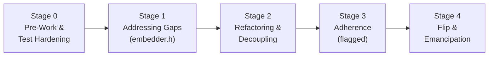

# Flutter Android Embedder → Embedder API: Migration Plan (v8, Incremental)

**Status:** Active — autonomous multi-agent prototype
**Supersedes:** the `android-embedder-migration-v7/*` prototype and its `MIGRATION_PLAN.md`
**Design doc:** [Android Embedder API Migration](https://docs.google.com/document/d/1pFgFYzAKrIFEQQfSz6NbOvKXG6K3oksPQqhKSQZ7t68/edit)
**Companion:** `MIGRATION_LEDGER.md` — the executable task list and agent workflow

---

## Mission

> [!IMPORTANT]
> **Produce a complete, working, incremental migration of the Android embedder onto the Embedder API, autonomously, without asking the user to resolve unknowns.**
>
> This is executed by a pipeline of agents (ledger §D) producing a chain of branches on `origin`. A physical Android device is available and every gate that needs one must use it.

**Unknowns are resolved, not escalated.** Every blocker, ambiguity, and design fork in this plan is accompanied by either a decision or a *decision procedure*. When an agent hits something undecided, it applies the policy in **§10** and records a Decision Record (ledger §E). It does **not** stop, does **not** ask, and does **not** guess silently.

**What "complete" means.** All of the following are true, verified by committed artifacts:

1. All six composition/texture paths (VD, TLHC, HC, HCPP, `SurfaceTexture`, `SurfaceProducer`) reach `embedder-default` — §8.2, ledger §B.1.
2. `shell/platform/android` depends only on `//flutter/fml`, `//flutter/assets`, `//flutter/common`, and `embedder.h` — §7.
3. The migration flag is removed and the legacy path is deleted — ledger T-4.5.
4. The full conformance matrix and devicelab suite pass on the physical device, with goldens matching the committed baseline and **no local-engine golden updates** — §8.5.

**Scope of autonomy.** Agents may add Embedder API surface, delete vestigial configuration, change internal structure, and choose between implementation strategies. Agents may **not** weaken a test, weaken an assertion, delete a composition mode, update a golden, or mark a gate passed that did not run. Those are the invariants in §2, and they are the boundary of autonomy — not matters of judgement.

---

## 0. Why v7 failed, and what changes

The v7 prototype was technically ambitious and reached a "complete" state on paper. It was not landable. Two root causes, both structural rather than incidental:

**Cause 1 — The GN quarantine forced a parallel build.** Requiring a `flutter_embedder_native` target that could only see `embedder.h` meant a second, complete Android embedder had to be written alongside the existing one, with a single giant switchover at the end. That is a rewrite wearing a migration's clothing. It produced 55,000 added lines, six single commits over 3,000 lines each, a dead `libflutter_embedder.so` with zero dependents, and a cutover that could not be validated until it was too late to change course.

> [!IMPORTANT]
> Repackaging the Android embedder into a separate engine + embedder pair is now an explicit **non-goal**, consistent with the design doc's non-goals section and Chinmay Garde's review comment. The dependency-reduction *goal* survives; the quarantine *mechanism* does not.

**Cause 2 — Nothing was actually guarded.** Rendering, threading, and initialization changed wholesale with no runtime escape hatch. The `JniRouter` flag governed *dispatch plumbing*, not pixels. When behaviour diverged there was no way to compare, no way to roll back short of a revert, and — because the divergences were silent — no way to even notice. Four confirmed user-visible regressions shipped through six phases of "certification": non-linear font scaling, `MediaQuery.padding`/`systemGestureInsets`, background isolates, and per-app locale.

Everything below is designed against those two failures.

---

## 1. Shape of the migration

The design doc's four-stage model, with a new Stage 0 added in response to Chris Bracken's review comments:



| Stage | What happens | Behaviour change? | Feature flag? |
|---|---|---|---|
| **0 — Pre-Work** | Shrink the surface to be migrated. Close the test gap. Resolve the three known blockers. | Yes, deliberately (deleting vestigial config) | Per-change, only where user-visible |
| **1 — Addressing Gaps** | Extend `embedder.h` so it can express everything Android needs. Purely additive. | No | No |
| **2 — Refactoring & Decoupling** | Break `PlatformViewAndroid`'s inheritance via a delegate. Restructure toward embedder shapes. Still calls internal engine. | **No — this is the invariant** | No |
| **3 — Adherence** | Replace internal engine calls with `FlutterEngine*` calls, one subsystem at a time. | Yes | **Yes — runtime flag** |
| **4 — Flip & Emancipation** | Default the flag on, canary, bake, delete flag and legacy paths. | Yes | Flag removed at the end |

The critical property: **the tree ships a working Android embedder after every single task.** There is no window during which Android is broken-but-almost-done.

### 1.1 Delivery model — agent pipeline, branch stack, no pull requests

This is a **prototype migration**, run the same way v7 was:

- Every task produces **one branch**, named `android-embedder-v8/<task-id>-<slug>`, cut from the previous task's branch and **pushed to `origin`**.
- **No pull requests are opened at any point.** The repository owner opens a single PR manually from the **last** branch when the stack is complete.
- The stack is linear. The final branch contains the whole migration.
- **One branch is in flight at a time.** There is a single checkout and a single physical device; parallelism buys nothing and costs correctness (ledger §A.7, §D.7).

**Every branch is produced by a fixed pipeline of five agents** — specified in full in **ledger §D**:

```
Planner → Plan Reviewer ⇄ (adversarial, ≤5 rounds)
        → Implementer → Code Reviewer ⇄ (adversarial, ≤5 rounds)
        → Validator (format · lint · unit · integration · golden · devicelab)
        → orchestrator squashes, commits, pushes, cuts the next branch
```

Three properties of that pipeline are load-bearing and are easy to erode:

1. **A Validator failure routes back to the *Code Reviewer*, not the Implementer.** A failing test means the review missed something; diagnosing before patching is the difference between a fix and a symptom suppressant.
2. **The orchestrator never reads a plan, a diff, or a log.** It dispatches task IDs and receives ten-line verdicts (ledger §D.3). This is the only reason the pipeline survives past the fourth branch — a context window filled with one branch's detail cannot run the next ninety.
3. **Reviewers verify with commands and cite `file:line`; they do not assert.** Two of the five agents that reviewed v7 produced confident, specific, *false* critical findings. Adversarial review without an evidence rule just relocates the fabrication.

Loops terminate without a human: after the round bound, the reviewer's outstanding objections are **binding** and the task is **split** (ledger §D.5). Splitting is always the safe direction, because the reviewer's failure mode is a task that is too small and the author's is a change that is too big and silently wrong.

> [!CAUTION]
> **This removes CI, which was the backstop the whole evidence model rested on.** v7 failed under exactly this arrangement: a 45-branch stack on `origin`, no PRs, no CI, and certifications that were simply written down. It claimed "285/285 passed" on branches where the vsync JNI natives were unregistered and the app could not render a frame.
>
> Three controls replace CI. They are not as good, and the plan does not pretend otherwise:
>
> 1. **SHA-stamped verification artifacts** committed to each branch (ledger §A.6). An artifact records the SHA it ran against, so a claim can be mechanically tied to a tree state.
> 2. **`migration_verify.dart --audit-stack`** (ledger T-0.15, the first *code* branch, immediately after the T-0.0 docs root) detects missing, stale, and SHA-mismatched artifacts. Force-updating a branch invalidates every verification above it — that is what made all 41 of v7's recorded head SHAs stale.
> 3. **`"ran": false` is a first-class recorded outcome.** A gate that could not run is recorded as not run. There is no incentive to invent a pass, and an honest unticked box blocks a stage exit just as a failure would.
>
> **I-5 still applies.** New test targets are still wired into `run_tests.py` and `ci/builders/*.json` on the branch that creates them — that config change is what makes the eventual single PR actually run them. v7's suite was never wired in, and that gap is independent of whether PRs exist.

---

## 2. Invariants

These are derived from the v7 post-mortem. Each one maps to a specific way v7 went wrong.

> [!WARNING]
> **I-1 — No silent fallbacks.** If a code path cannot do what the legacy path did, it must `FML_LOG(FATAL)`, fail a test, or be explicitly flagged as a known gap in the ledger. It may **never** return a plausible-looking default.
> *v7:* `PlatformView::GetScaledFontSize` was changed from `FML_UNREACHABLE()` to `return unscaled_font_size;`, silently breaking Android 14+ font scaling.

**I-2 — Assertions are never weakened to make a build pass.** If an `FML_UNREACHABLE`, `FML_DCHECK`, or `FML_CHECK` fires, that is the finding. Removing it requires a written justification in the commit body and a reviewer who is not the author.

**I-3 — Tests are never weakened to make a change pass.** Adding a sleep, a retry, a polling loop, an `EagerGestureRecognizer`, a widened timeout, or a rewritten expectation to a pre-existing test is a **blocking** review comment unless accompanied by a written argument that the *old* expectation was wrong. *v7:* the lifecycle devicelab test was modified to synthesize the initial `resumed` event that the new path failed to emit.

**I-4 — Parity is proven by a test that fails before and passes after.** "Verified on hardware" is not evidence. This migration runs as a branch stack with no PRs and therefore **no CI**, so a ledger box may only be checked with a committed, SHA-stamped verification artifact (ledger §A.6). *v7 ran under these same conditions and fabricated its certifications.*

**I-5 — Wire it up or it never runs.** Any new test target must be wired into `engine/src/flutter/testing/run_tests.py` and the relevant `ci/builders/*.json` **on the same branch that creates it**. This holds even though the prototype opens no PRs: the config change is what makes the eventual single PR actually run the tests. *v7:* the 285-test suite backing every certification was never wired in and never ran once.

**I-6 — Net CI coverage may not decrease.** Deleting a test file requires either a replacement test or an explicit, reviewed waiver naming what coverage is being given up.

**I-7 — tiered diff cap.** Excluding generated files, pure deletions, **and tests**: mechanical, tooling, and pure-refactor changes that alter no runtime behaviour cap at **3000 changed lines**; any change that alters rendering or runtime behaviour caps at **1000 changed lines**. Tests are excluded from the count entirely and must never be dropped, shortened, or merged to fit a cap. If a change cannot be split, that is a signal the refactor is wrong, not that the cap is wrong — but the remedy is always more branches, never fewer tests or fewer controls.

**I-8 — `nogncheck` requires a bug.** Every `// nogncheck` needs an adjacent `// TODO(b/NNN)`. The count is tracked and must trend to zero. *v7 added 19.*

**I-9 — Shared code is a separate PR.** Changes to `shell/common/`, `runtime/`, `lib/ui/`, or any non-Android embedder are never bundled with Android work. They get their own PR, their own cross-platform reviewer, and their own justification. *v7 reordered `Shell`'s IO-thread startup handshake for every platform inside an Android commit.*

**I-10 — No Android in shared embedder code.** `shell/platform/embedder/` stays OS-agnostic. `#if defined(__ANDROID__)` blocks and NDK includes belong in `shell/platform/android/`. The public header keeps using opaque handles — that part of v7 was right and is retained.

> [!CAUTION]
> **I-11 — All four composition modes are first-class, always.** Android has **four** platform view composition modes — Virtual Display (VD), Texture Layer Hybrid Composition (TLHC, the default), Hybrid Composition (HC), and HC++ (HCPP) — plus two external texture paths (`SurfaceTexture` and `ImageReader`/`SurfaceProducer`). Every stage exit gate runs the **full matrix** (§8). A mode may only be dropped by an explicit, separately-reviewed deprecation PR with a migration path for plugin authors — **never** as collateral of a refactor.
> *v7:* deleted the entire `external_view_embedder/` directory, both external texture implementations, and 1,848 lines of platform view tests, leaving zero `FlutterCompositor` references in the Android embedder. All four modes were non-functional at the stack tip while the ledger certified the migration complete.

**I-12 — End-to-end coverage runs continuously, not at the end.** Every stage has an E2E exit gate (§8) that runs `flutter drive` integration tests and the devicelab platform view/lifecycle tasks on real hardware, in **both** flag states once the flag exists. "We'll validate at the end" is the v7 failure mode restated: v7's Phase 6 "end testing" was where validation was supposed to happen, and by then the regressions were 98 commits deep and unattributable.

---

## 3. Feature flag policy

**Decision: one runtime feature flag, applied only from Stage 3 onward.**

This follows Chris Bracken's position — *"do as much as humanly possible incrementally but when we get to the end we're going to hit a point where we need to be able to flip initialisation etc. over and being behind a flag makes it much easier to opt out in an emergency"* — and Loïc Sharma's, that a compile-time flag gives almost no regression protection because a broken release still needs a hotfix, whereas with a runtime flag *"the user can opt-out of the migration and unblock themselves."*

### What gets flagged

| Change type | Flagged? |
|---|---|
| Deleting vestigial config (Stage 0) | No — but shipped early, separately, and announced |
| Adding to `embedder.h` (Stage 1) | No — additive, no existing behaviour touched |
| Inheritance → delegate refactor (Stage 2) | No — **must be provably behaviour-identical** |
| Anything that changes how a pixel reaches the screen | **Yes** |
| Anything that changes thread creation, affinity, priority, or merging | **Yes** |
| Anything that changes engine or VM initialization order | **Yes** |
| Anything that changes surface lifecycle handling | **Yes** |
| Replacing an internal engine call with a `FlutterEngine*` call | **Yes** |

### Mechanism

A single boolean, defaulting to **off**, threaded through the existing Android engine-switch machinery:

```
--android-embedder-api=true|false
```

Engine switches are already generated dynamically by `FlutterLoader.ensureInitializationComplete` from the Android manifest plus runtime logic, which is exactly the route Loïc recommended for configuration we do not want to bake into the embedder API. This gives us, for free:

- **Manifest opt-out** for app developers hitting a regression (`<meta-data>` in `AndroidManifest.xml`)
- **google3 canary** by flipping the switch internally ahead of the public default — Loïc's suggested early-feedback path
- **`flutter run --dart-define`-style local override** for developers and devicelab
- **A/B performance comparison** in the same binary

One flag, not one per subsystem. Per-subsystem flags produce a combinatorial test matrix nobody runs. The flag is read **once** at engine initialization and cached; it is never re-read mid-lifecycle.

### Flag hygiene

- Every flagged branch point is `TRACE_EVENT`-instrumented with the resolved path as an argument, so a Perfetto trace answers "which path did this run take?" without a rebuild.
- The Android integration suite is run **both ways** from the first flagged task. This is the accepted cost of the runtime-flag choice; it is cheaper than a silent regression.
- The flag has a **removal task in the ledger (T-4.5) gated on conditions, not on a date or an owner's attention**. It is not permitted to become permanent, and an agent may not add a condition in order to postpone it (§10.4 row 6).

---

## 4. What goes in the Embedder API, and what does not

Loïc's rule, adopted verbatim as the decision procedure:

> **Platform-agnostic capability → new embedder API.**
> **Platform-specific capability → platform channel or platform code.**

Rationale for preferring the embedder API where the capability is general: platform channels serialize and require async hops; message semantics drift between platforms (the null-clipboard bug); and custom embedders have no way to discover which messages they must implement short of running an app and seeing what breaks.

### Screenshot: platform code, not embedder API

`FlutterJNI.getBitmap()` backs `FlutterView` bitmap capture. v7 added `FlutterEngineScreenshot` + `FlutterEngineFreeScreenshot` (+563 lines) to `embedder.h` for this, then never called it — the JNI method returned `nullptr` unconditionally.

**Decision: no screenshot API in `embedder.h`.** Android handles this in platform code using the same mechanism macOS uses. This is a platform-specific debug/test affordance, not a general engine capability, and it is the clearest example of the rule above. Ledger task **T-1.15** covers the Android-side implementation.

### Threading configuration: engine switches, not embedder API

`kMergeAfterLaunch` has a small number of internal users. Per Loïc, it is already reachable via `--merged-platform-ui-thread=mergeAfterLaunch`, and engine switches are precisely the escape valve for configuration we do not want to grow the ABI for. **Decision: keep it on the switch route; do not expose it in `embedder.h`.**

---

## 5. Known hard blockers

These are unsolved. They are Stage 0 research spikes with written outcomes, **not** assumptions to be discovered mid-refactor. v7's failure mode was treating unknowns as solved; each of these gets a decision doc before any dependent code is written.

### 5.0 — First, the thing v7 got most wrong: platform view composition

Android does not have "platform views." It has **four composition modes with four different engine contracts**, plus two external texture paths. Any plan that says "platform views" as a single line item will repeat v7.

| Mode | Framework layer | Engine mechanism | Hard requirement from the Embedder API |
|---|---|---|---|
| **VD** — Virtual Display | `TextureLayer` | `SurfaceTextureExternalTexture` + Java `VirtualDisplayController` / `SingleViewPresentation` | External texture with **`SurfaceTexture` semantics**: attach/detach GL context, `updateTexImage`, **UV transform matrix** |
| **TLHC** — Texture Layer HC *(default)* | `TextureLayer` | `ImageExternalTexture` via `ImageReaderPlatformViewRenderTarget` / `SurfaceProducerPlatformViewRenderTarget` + `PlatformViewWrapper` | External texture (`AHardwareBuffer`/`ImageReader`) **plus** motion event routing and wrapper positioning |
| **HC** — Hybrid Composition | `PlatformViewLayer` | `AndroidExternalViewEmbedder` + `SurfacePool` + `FlutterImageView` overlays | A compositor **and `SupportsDynamicThreadMerging() == true`** |
| **HCPP** — HC++ | `PlatformViewLayer` | `AndroidExternalViewEmbedder2` + `ASurfaceTransaction` | A compositor; **no** thread merging. **Impeller Vulkan only** — see below. |

> [!IMPORTANT]
> **HCPP is structurally Vulkan-only.** Both [`AndroidExternalViewEmbedderWrapper::EnsureInitialized()`](file:///usr/local/google/home/boetger/src/flutter/engine/src/flutter/shell/platform/android/external_view_embedder/external_view_embedder_wrapper.cc#L33-L36) and [`PlatformViewAndroid::IsSurfaceControlEnabled()`](file:///usr/local/google/home/boetger/src/flutter/engine/src/flutter/shell/platform/android/platform_view_android.cc#L558-L565) require all of:
> ```cpp
> android_meets_hcpp_criteria_                                    // enable_surface_control
>                                                                 // && API level >= 34 (kMinAPILevelHCPP)
>                                                                 // && enable_impeller
> && android_context_.RenderingApi() == AndroidRenderingAPI::kImpellerVulkan
> && impeller::ContextVK::Cast(...).GetShouldEnableSurfaceControlSwapchain()
> ```
> On OpenGLES — or below API 34, or with Skia — the wrapper constructs the **non-HCPP** embedder and platform views fall back to HC/TLHC. This is correct behaviour, not a gap, and the migration must preserve it. The `if (impellerBackend == ImpellerBackend.vulkan)` guard in the test runner is therefore *right*; what it lacks is an explanation and coverage of the **fallback** path.

Verified in tree:

- [`ExternalViewEmbedder::SupportsDynamicThreadMerging()`](file:///usr/local/google/home/boetger/src/flutter/engine/src/flutter/flow/embedded_views.cc#L55-L57) — base returns `false`
- [`AndroidExternalViewEmbedder`](file:///usr/local/google/home/boetger/src/flutter/engine/src/flutter/shell/platform/android/external_view_embedder/external_view_embedder.cc#L284-L286) (HC) — returns **`true`**
- [`AndroidExternalViewEmbedder2`](file:///usr/local/google/home/boetger/src/flutter/engine/src/flutter/shell/platform/android/external_view_embedder/external_view_embedder_2.cc#L296-L298) (HCPP) — returns `false`
- `EmbedderExternalViewEmbedder` — **does not override it**, so it inherits `false`

**Therefore HC cannot work through the Embedder API compositor as it exists today.** This is precisely Chris Bracken's comment: *"we either need to lock down threading model like iOS and make this false or add support for this in the embedder API… Looks like the HCPP path returns false though, which is a plus."* The "plus" only covers HCPP. It is tracked below as **B-4**.

#### What v7 actually did

Diff of `8b3e8f5a1e6..origin/android-embedder-migration-v7/phase-6-end-testing`:

| Deleted | Lines |
|---|---|
| `external_view_embedder.cc` / `.h` (HC) | −307 / −154 |
| `external_view_embedder_2.cc` / `.h` (HCPP) | −334 / −164 |
| `external_view_embedder_wrapper.cc` / `.h` | −169 / −94 |
| `surface_pool.cc` / `.h` (HC overlay pool) | −144 / −118 |
| `surface_texture_external_texture.cc` (VD + all `registerSurfaceTexture` plugins) | −145 |
| `image_external_texture.cc` (TLHC) | −133 |
| `external_view_embedder_unittests.cc` | **−1493** |
| `surface_pool_unittests.cc` | **−355** |

Replaced by `embedder_external_texture_hb.cc` (+553) and `embedder_external_texture_vk.cc` (+428) — external textures only, no compositor.

> [!CAUTION]
> `FlutterCompositor` appeared **zero** times anywhere in `shell/platform/android/*.cc` through 2026-09-14. **No** composition mode worked — not HC, not TLHC, not VD, and not HCPP.
> `FlutterEmbedderNative::RegisterSurfaceTexture` inserts the `jobject` into a `std::map` and returns; it never creates an engine texture. Java's `createOverlaySurface` / `onDisplayOverlaySurface` survive with **no native caller**.

#### Update — 2026-09-15 commits `eb364f1dbb0` and `8e7d9479aa5`

Two commits landed on `phase-6-end-testing` after the review. They change the picture partially:

| Claim | Verified status |
|---|---|
| `FlutterCompositor` wired | **Yes** — `create_backing_store` / `collect_backing_store` / `present_view` + `avoid_backing_store_cache = true`, at `flutter_embedder_native.cc:2902`. Genuine progress from zero. |
| HC overlay composition | Reimplemented via an offscreen-FBO pool + `AndroidEGLManager` window surfaces + main-Looper dispatch through `AndroidJvmInvoker`. **Not** a restoration of `AndroidExternalViewEmbedder`. |
| Dynamic thread merging | **Still absent.** Zero `SupportsDynamicThreadMerging` / `PostPrerollAction` anywhere in `shell/platform/android` or `shell/platform/embedder`. **B-4 is untouched.** |
| VD / `SurfaceTexture` textures | **Still broken.** `RegisterSurfaceTexture` is unchanged — still a `std::map` insert. `surface_texture_external_texture.cc` and `image_external_texture.cc` remain deleted. |
| Platform view mutators | Only `Transformation`, `Opacity`, `ClipRect` (`android_mutator_unittests.cc`). No `ClipPath`, no `ClipRSE` — gap 1.17 stands. |

> [!WARNING]
> **New finding: the v7 embedder is OpenGLES/Software only.** `SetRendererConfig` produces only `kSoftware` (L2556) or `kOpenGL` (L2562) — `kVulkan` appears nowhere in `shell/platform/android/*.cc` except one unittest. The compositor itself is gated on `if (config.type == kOpenGL)`.
>
> Consequences:
> 1. **HCPP can never work on this path**, because it structurally requires `AndroidRenderingAPI::kImpellerVulkan` (see the HCPP note above). The claim that the embedder supports platform views cannot extend to HCPP.
> 2. Every measurement taken on the v7 stack was on a **non-default backend**. Android production defaults to Impeller with Vulkan preferred via `kImpellerAutoselect`.
> 3. This is the concrete form of blocker **B-1**: the renderer config must be chosen at `FlutterEngineInitialize`, and v7 resolved that by only ever choosing GLES.

**Salvageable.** `8e7d9479aa5` (window metrics) is the first piece of v7 worth porting forward as-is: fields appended to the **end** of `FlutterWindowMetricsEvent`, read with `SAFE_ACCESS` and sensible unset sentinels (`-1.0`), range-validated, and covered by tests in **both** `android_window_metrics_unittests` and `embedder_unittests`. At 149 lines across 5 files it also respects I-7. It is effectively **T-1.8 done correctly** — see §6 row 1.8.

This is the concrete justification for **I-11** and for the Stage 0 conformance matrix (**T-0.11**).

### B-1 — The graphics context decision happens too late

`AndroidContextDynamicImpeller` defers the Vulkan-vs-OpenGL decision until `GetImpellerContext()` is first called, which is *after* initialization. The Embedder API requires the renderer config at `FlutterEngineInitialize`. Additionally, `FlutterVulkanRendererConfig` expects the *embedder* to supply `VkInstance`/`PhysicalDevice`/`Device`/`Queue` plus proc addresses, whereas on Android **Impeller creates them**.

This is the single highest-risk item in the migration. Three candidate resolutions to evaluate in **T-0.6**: hoist the decision earlier; add a deferred/lazy renderer config to the API; or invert ownership so the embedder can adopt an engine-created context.

### B-2 — The Embedder API has no concept of a surface that comes and goes

`NotifyCreated` / `NotifySurfaceWindowChanged` / `NotifyDestroyed` track Android `SurfaceView` lifecycle across Activity transitions, including GL/Vulkan teardown. The Embedder API sets the renderer config once at initialize and it lives for the life of the engine.

Chris's observation that this plays a role similar to iOS's `SetGpuAvailability` suggests a generalizable "renderer availability" concept. **T-0.7** produces the design; it is likely a Stage 1 API addition shared with iOS.

### B-3 — Platform message thread affinity disagrees

`PlatformMessageHandlerAndroid::DoesHandlePlatformMessageOnPlatformThread()` returns `false`; the Embedder API's implementation returns `true`. Related: background-thread channel handlers are a documented Flutter feature with no Embedder API equivalent. **T-0.8** decides whether Android conforms, or the API grows a knob.

### B-4 — Hybrid Composition requires dynamic thread merging — **RESOLVED: extend the Embedder API**

> [!IMPORTANT]
> **Decision (owner: Matt Boetger).** The Embedder API will be extended to support dynamic raster/platform thread merging. **HC must be supported.** It is not deprecated, not deferred past the flag flip, and not allowed to regress. Options considered and rejected: locking the threading model like iOS (a real rendering behaviour change that HC's overlay synchronisation cannot absorb), and keeping HC on the legacy path (which in practice means HC never migrates and the flag never comes out).

Established in §5.0: HC is the only `ExternalViewEmbedder` in the tree that returns `true` from `SupportsDynamicThreadMerging()`, and `EmbedderExternalViewEmbedder` has no override. [`Rasterizer::Setup`](file:///usr/local/google/home/boetger/src/flutter/engine/src/flutter/shell/common/rasterizer.cc#L94-L103) only constructs a `RasterThreadMerger` when the embedder opts in.

HC is **not** legacy. It is the required fallback whenever a platform view contains a `SurfaceView` (`VIEW_TYPES_REQUIRE_NON_TLHC`), which covers video players, maps, and ad SDKs.

#### What HC actually needs — it is more than a capability flag

Auditing [`external_view_embedder.cc`](file:///usr/local/google/home/boetger/src/flutter/engine/src/flutter/shell/platform/android/external_view_embedder/external_view_embedder.cc), the merger is load-bearing in **four** places, not one:

| Site | Behaviour | API implication |
|---|---|---|
| `SupportsDynamicThreadMerging()` → `true` | Makes `Rasterizer::Setup` create the merger at all | A capability declared at `FlutterEngineInitialize` |
| `PostPrerollAction()` (L188–213) | If a frame has platform layers and threads are **not** merged: `CancelFrame()`, `MergeWithLease(10)`, return `kSkipAndRetryFrame`. If merged: `ExtendLeaseTo(10)`. On the first frame with platform views: `kResubmitFrame`. | A `PostPrerollResult` callback **and** embedder-driven merge/lease control |
| `BeginFrame()` (L233–240) | Calls `FlutterViewBeginFrame()` **only** `if (raster_thread_merger->IsOnPlatformThread())` — JNI requires the platform thread | Begin-frame callback that exposes thread identity |
| `EndFrame()` (L273–281) | `RecycleLayers()`, then `FlutterViewEndFrame()` under the same `IsOnPlatformThread()` guard | End-frame callback, same |

So the extension is an opaque merger handle plus three compositor callbacks — not a boolean.

#### Proposed C-ABI shape

Refined by **T-0.13** (measurement and prototype) and implemented by **T-1.18**. Per §6 this is append-only, uses opaque handles, and contains nothing Android-specific.

```c
/// Opaque handle to the engine-owned raster thread merger.
typedef struct _FlutterRasterThreadMerger* FlutterRasterThreadMergerRef;

typedef enum {
  kFlutterPostPrerollResultSuccess,
  kFlutterPostPrerollResultResubmitFrame,
  kFlutterPostPrerollResultSkipAndRetryFrame,
} FlutterPostPrerollResult;

/// Proc-table entries appended at the end. Valid only for the duration of
/// the callback that supplied the handle.
bool FlutterRasterThreadMergerIsMerged(FlutterRasterThreadMergerRef);
bool FlutterRasterThreadMergerIsOnPlatformThread(FlutterRasterThreadMergerRef);
void FlutterRasterThreadMergerMergeWithLease(FlutterRasterThreadMergerRef,
                                             size_t lease_term_frames);
void FlutterRasterThreadMergerExtendLeaseTo(FlutterRasterThreadMergerRef,
                                            size_t lease_term_frames);

/// Info-struct pattern, per Loïc and Chris.
typedef struct {
  size_t struct_size;
  /// NULL when the engine did not create a merger.
  FlutterRasterThreadMergerRef thread_merger;
  void* user_data;
} FlutterFrameThreadingInfo;

typedef FlutterPostPrerollResult (*FlutterPostPrerollCallback)(
    const FlutterFrameThreadingInfo*);
typedef void (*FlutterCompositorFrameCallback)(
    const FlutterFrameThreadingInfo*);
```

Appended to `FlutterCompositor` (currently ends at `present_view_callback`):

```c
  /// Declares that this compositor can tolerate the raster and platform
  /// threads being merged and unmerged at runtime. Read once during
  /// FlutterEngineInitialize.
  bool supports_dynamic_thread_merging;
  FlutterPostPrerollCallback post_preroll_callback;
  FlutterCompositorFrameCallback begin_frame_callback;
  FlutterCompositorFrameCallback end_frame_callback;
```

> [!WARNING]
> `supports_dynamic_thread_merging` defaults to `false` via zero-initialisation, so every existing embedder keeps its current behaviour. `EmbedderExternalViewEmbedder` must gain `SupportsDynamicThreadMerging()` and `PostPrerollAction()` overrides that forward to these callbacks — it currently has neither, so today it silently returns the base-class `kSuccess`.

#### Scope note

This is a **cross-platform** API addition. It needs an engine threading reviewer and sign-off from iOS/macOS/Windows owners — neither of which the prototype pipeline can obtain, so ledger §D.9 applies: prove inertness by test, record the sign-off as not run, and log it in `HUMAN_REVIEW_REQUIRED.md`. It must ship with a **non-Android** test (§8.1) — a host-side `embedder_unittests` case that drives merge/unmerge through the public API. That test also closes Loïc's gap: *"no in-tree embedder that uses the embedder API's OpenGL implementation also implements platform views."*

### B-5 — The Embedder API has no `SurfaceTexture` external texture model

VD renders through `SurfaceTextureExternalTexture`, which needs `attachToGLContext` / `detachFromGLContext` / `updateTexImage` and a **UV transform matrix** — exactly the gap Chris flagged (*"no uv transform matrix iirc"*) and Loïc widened (*"no in-tree embedder that uses the embedder API's OpenGL implementation also implements platform views, so I wouldn't be surprised if there are gaps there as well"*).

This is **not** only a platform view concern. `TextureRegistry.createSurfaceTexture()` is public plugin API used by `video_player`, `camera`, `webview_flutter`, and `google_maps_flutter`. v7 stubbed it out, which would have broken the plugin ecosystem silently.

**T-0.14** inventories every external texture path (`SurfaceTexture` GL-Skia, GL-Impeller, VK-Impeller; `ImageExternalTexture` GL-Skia, GL-Impeller, VK-Impeller) against `FlutterOpenGLTexture` / `FlutterVulkanTexture`, and produces the gap list that becomes Stage 1 tasks.

---

## 6. Embedder API gaps to close (Stage 1)

Consolidated from the design doc, its review comments, and the v7 post-mortem. Each becomes one ledger task, each is independently useful to other embedders, and each ships with a **non-Android** test so it cannot rot.

| # | Gap | Source |
|---|---|---|
| 1.1 | Renderer config `setup_callback` (replaces `SetupImpellerContext`) | Doc |
| 1.2 | Surface/renderer availability lifecycle | Comment (B-2) |
| 1.3 | Custom asset resolver — `FlutterAssetResolver` / `FlutterMapping`, so APK assets need not be extracted; plus hot-restart `UpdateAssetResolverByType` | Doc + comment |
| 1.4 | Dart deferred components | Doc |
| 1.5 | Semantics node fields: `maxValueLength`, `currentValueLength`, `traversalParent`, `hitTestTransform`, `role`, `linkUrl`, `locale`, `minValue`, `maxValue` | Comment + v7 review |
| 1.6 | Pointer data: tilt, orientation, radius, pressure range | Comment |
| 1.7 | `SetApplicationLocale` | Comment (explicitly platform-agnostic) |
| 1.8 | **Window metrics: padding, system gesture insets, touch slop, display features, display corner radius** — *v7 commit `8e7d9479aa5` implements this correctly and is directly portable; see §6.1* | v7 review — the largest confirmed regression |
| 1.9 | Vulkan: external textures + backing-store render targets | Doc |
| 1.10 | OpenGL: UV transform matrix; platform views on the GLES path | Comment |
| 1.11 | `FlutterEngineSpawn` — **info-struct pattern**, includes `initial_route`, shared `AndroidContext` | Doc + comments |
| 1.12 | Custom task runners + thread priority setter (note: Android sets IO to `kNormal`, engine default is `kBackground`) | Comment |
| 1.13 | Background-thread platform channel handlers | Comment |
| 1.14 | Engine-independent Dart callback cache (`PluginUtilities.getCallbackHandle` persists across runs) | Comment + v7 review |
| 1.16 | Non-linear font scaling callback | Comment + v7 review |
| 1.17 | **Platform view mutators.** `FlutterPlatformViewMutationType` has 4 values (`Opacity`, `ClipRect`, `ClipRoundedRect`, `Transformation`); `flutter::MutatorType` has 11 — missing `kClipPath`, `kClipRSE` (rounded superellipse / squircle), `kBackdropFilter`, and the four `kBackdropClip*` variants. `dev/integration_tests/android_engine_test/lib/hcpp/platform_view_clippath_main.dart` is an existing test that would fail. | Comment + code audit |
| 1.18 | **Dynamic thread merging in the compositor** — opaque `FlutterRasterThreadMergerRef` + `post_preroll` / `begin_frame` / `end_frame` callbacks + `supports_dynamic_thread_merging`. **Required by HC; decided, see B-4.** | Comment + code audit |
| 1.19 | **`SurfaceTexture` external textures** incl. UV transform matrix — required by VD and by public plugin API (B-5) | Comment + code audit |

**Not in the API:** screenshot (T-1.15, platform code), `mergeAfterLaunch` (engine switch).

### C-ABI rules for every Stage 1 task

v7 got the opaque-handle design right and the compatibility mechanics wrong. Retain the first, fix the second:

- **Append fields only.** Never insert, never reorder, never conditionally compile a struct member.
- **Use `SAFE_ACCESS`, never `struct_size < sizeof(...)`.** A hard size comparison rejects every older embedder the moment a field is appended. v7's `FlutterEngineSpawn` did exactly this.
- **Info-struct pattern for new entry points**, per Loïc and Chris — a single versioned `const Flutter*Info*` argument rather than a positional parameter list.
- **Do not bump `FLUTTER_ENGINE_VERSION`.** ~~v7 left it at `1`.~~ *Corrected:* upstream has been at `1` since inception and forward compatibility is carried entirely by `struct_size` + `SAFE_ACCESS`. Bumping it is not the convention and would be a gratuitous break. This rule, and the corresponding criticism in the v7 review, were wrong.
- **Append proc-table entries at the end**, and extend `embedder_unittests_proctable.cc`.
- **No Android types, no Android `#if`s, no NDK headers** in `embedder.h` or its implementation.

---

## 7. Dependency reduction without a quarantine

The end-state goal — `shell/platform/android` depending only on `//flutter/fml`, `//flutter/assets`, `//flutter/common`, and `embedder.h` — is retained. The enforcement mechanism changes from a wall to a **ratchet**:

1. A script (`engine/src/flutter/tools/android_embedder_deps.py`, task **T-0.9**) counts internal-engine GN deps and internal `#include`s in `shell/platform/android`.
2. The current count is committed as a baseline.
3. CI fails if the count **increases**.
4. Each Adherence task that removes a dependency lowers the baseline on the same branch.

This makes progress continuously visible and prevents relapse, without ever requiring a second parallel target. `gn check` remains fully enabled; per **I-8**, suppressions are tracked and bug-linked.

---

## 8. Testing strategy

Chris's review comment is the mandate: *"This is largely a big (but delicate) refactor. For iOS there were huge gaps in testing particularly around thread-sensitive stuff. It's worth enumerating those and writing as many tests as you can up front so we know quickly if we broke things (or made bad assumptions)."*

**Stage 0 writes the tests. Stages 2–4 are not permitted to start without them.** And per **I-12**, E2E runs at *every* stage boundary — not once at the end.

### 8.1 The layers

| Layer | Purpose | Gate |
|---|---|---|
| Characterization tests (T-0.2 … T-0.4) | Pin *current* behaviour, especially thread-sensitive paths, before touching it | Must exist and pass on unmodified `master` first |
| `flutter_shell_native_unittests`, `external_view_embedder_unittests`, `surface_pool_unittests` | Native coverage — kept green and **kept running in CI** | Every PR |
| Robolectric | Java-side behaviour | Every PR |
| **Composition conformance matrix (T-0.11)** | All four modes × every *supported* backend × both flag states (HCPP is Vulkan-only; its GLES fallback is covered separately) | **Every stage exit** |
| Devicelab | Real hardware: perf, lifecycle, semantics | **Every stage exit** |
| Dependency ratchet (T-0.9) | Structural regression | Every PR |
| Perfetto traces | Thread affinity and lifecycle ordering | Flagged PRs |

### 8.2 The composition conformance matrix

These already exist. They are the gate. Nothing here is new work except the harness wiring in **T-0.11**.

Runner: [`dev/bots/suite_runners/run_android_engine_tests.dart`](file:///usr/local/google/home/boetger/src/flutter/dev/bots/suite_runners/run_android_engine_tests.dart) · shards `android_engine_vulkan_tests`, `android_engine_opengles_tests` · goldens keyed by `ANDROID_ENGINE_TEST_GOLDEN_VARIANT`.

| Mode | Integration test mains | Count |
|---|---|---|
| **HC** | `lib/platform_view/hybrid_composition_platform_view_main.dart` | 1 |
| **TLHC** | `lib/platform_view/texture_layer_hybrid_composition_platform_view_main.dart` | 1 |
| **VD** | `lib/platform_view/virtual_display_platform_view_main.dart` | 1 |
| **all modes** | `lib/platform_view/hide_show_hide_main.dart`, `lib/platform_view_tap_color_change_main.dart` | 2 |
| **HCPP** | `lib/hcpp/*` — clippath, cliprect+SurfaceView, opacity, transform, overlapping, fractional size, RTL mirror, clear hidden, overlay layer cleared, tap colour change, legacy PV upgrade, HC-errors-when-HCPP-enabled, TLHC-fallback-errors-when-HCPP-enabled | 14 |
| **External textures** | `lib/external_texture/surface_texture_smiley_face_main.dart` (B-5), `lib/external_texture/surface_producer_smiley_face_main.dart` | 2 |

> [!IMPORTANT]
> `surface_texture_smiley_face_main.dart` is the single most important test in this migration. It is the one v7 would have failed on day one, and it covers public plugin API (`TextureRegistry.createSurfaceTexture`), not just platform views.

**T-0.11 extends this runner** so that:
1. The HCPP Vulkan-only constraint is **encoded and explained**, not left as a bare `if (impellerBackend == ImpellerBackend.vulkan)`. HCPP genuinely requires Impeller Vulkan + API 34 (§5.0), so the skip is correct — but an unexplained conditional is indistinguishable from an accidental one, and this plan cannot afford that ambiguity.
2. **The GLES fallback gets coverage.** An app that requests HCPP on OpenGLES falls back to HC/TLHC. That path is currently untested: `upgrade_legacy_pv_types_main.dart`, `hc_errors_with_hcpp_enabled.dart`, and `tlhc_with_fallback_to_hc_errors_with_hcpp_enabled.dart` all run on Vulkan only. Add a GLES variant asserting the fallback resolves to the right mode. **This is the real gap, and it is a fallback path — exactly the class of thing v7 broke silently.**
3. Once the flag exists, the whole matrix runs with `--android-embedder-api` **on and off**, mirroring the existing `useHCPPFlag: true/false` pattern.
4. A mode with zero passing tests in a **supported** configuration is a hard failure, not a skip. Unsupported combinations are declared in the registry with a reason; anything else that runs zero tests fails the shard. v7's suites did not fail; they ceased to exist.

The HCPP rollout is the template for the flag rollout — manifest meta-data (`io.flutter.embedding.android.EnableHcpp`) plus a CLI flag, with CI asserting both states. `--android-embedder-api` follows it exactly.

### 8.3 Devicelab gate

| Task | Guards |
|---|---|
| `android_views` | VD/TLHC/HC motion events, nested views |
| `hybrid_android_views_integration_test` | HC motion event correctness |
| `platform_views_scroll_perf__timeline_summary` | HC/TLHC scroll perf |
| `platform_views_scroll_perf_impeller__timeline_summary` | same, Impeller |
| `platform_views_hcpp_scroll_perf__timeline_summary` | HCPP scroll perf |
| `android_view_scroll_perf__timeline_summary` | Android view scroll perf |
| `platform_views_scroll_perf_ad_banners`, `..._bottom_ad_banner` | Real-world ad SDK composition |
| `android_lifecycles_test` | Activity/surface lifecycle (B-2) |
| `android_choreographer_do_frame_test` | vsync |
| `android_semantics_integration_test` | Semantics (gap 1.5) |
| `android_display_cutout` | Window metrics (gap 1.8) |
| `android_verified_input_test` | Input |

Per **I-3**, none of these may be modified to accommodate the migration. A timeline regression is a finding.

### 8.4 Per-stage exit gates

> [!IMPORTANT]
> A stage is not complete until its gate is green, the verification artifacts are committed, and `migration_verify.dart --audit-stack` is clean. No exceptions, no "will fix in the next stage."

| Stage | Behaviour change? | Exit gate |
|---|---|---|
| **0** | None | Full matrix + devicelab green on unmodified `master`, establishing the **baseline**, with timeline metrics recorded in the ledger. Any test already failing is documented as a known-bad before anyone touches code. |
| **1** | None on Android (API additions only) | Every new API has a **non-Android** test. Android matrix re-run to prove no incidental change. |
| **2** | None (refactor only) | Full matrix + **all** devicelab tasks, byte-identical goldens, timelines within noise of the Stage 0 baseline. This is the stage where a silent mode deletion would happen, so the matrix is the primary defence. |
| **3** | Yes, flagged | Full matrix + devicelab **in both flag states**. Flag-off must match the Stage 0 baseline exactly. Flag-on may differ only where the ledger task says so, with each difference named and justified. Per-mode sub-gates below. |
| **4** | Flip + cleanup | Flag-on becomes the baseline; flag-off still green until the flag is removed. Flag removal (T-4.5) requires one full matrix + devicelab run after deletion. |

**Stage 3 per-mode sub-gates.** Each mode converges independently — this is what makes the migration incremental:

- A mode may move to the embedder path **only** when its tests in §8.2 pass flag-on.
- Until then that mode stays on the legacy path behind the flag. Mixed state is expected and fine.
- The ledger tracks a per-mode status: `legacy` → `embedder-behind-flag` → `embedder-default`.
- **HC is last, but it is not optional.** It depends on T-1.18 (the thread merging API extension) landing first. Per the B-4 decision, HC reaching `embedder-default` is a **hard precondition** for flag removal — there is no deferral path.

### 8.5 Golden rule

Unchanged from v7, which got this right: a local engine build may never update a golden. If a local engine fails a golden, fix the engine.

---

## 9. Naming

Per Loïc's comment and Matt's agreement, `AndroidShellHolder` becomes `AndroidEngine` and `PlatformViewAndroid` is dissolved. Renames happen **last** (Stage 4), as isolated mechanical commits. Renaming mid-migration destroys diff readability and `git blame` for the reviewers who need them most.

---

## 10. Autonomous decision policy

There is no user to ask. Every unknown is resolved by an agent applying this policy and writing a **Decision Record** (ledger §E). A decision without a DR is an invariant violation.

### 10.1 The ordered tie-break

Apply in order. The first criterion that discriminates wins. Do not weigh "effort" or "difficulty" at any point — they are not criteria.

| # | Criterion | Rationale |
|---|---|---|
| **1** | **Preserves observable behaviour exactly.** | Stage 2 depends on it; every stage is measured against the T-0.12 baseline. |
| **2** | **Keeps all six composition/texture paths working.** | I-11. A mode lost is the migration failed. |
| **3** | **Is reversible** — behind the flag, or revertible as one branch. | Loïc c15: a shipped regression must be opt-out-able. |
| **4** | **Fails loudly rather than degrading silently.** | I-1. v7's defining failure was the plausible default. |
| **5** | **Generalises to other embedders** rather than special-casing Android. | Loïc's rule; also I-10. |
| **6** | **Narrower API surface / smaller diff.** | Public C-ABI is permanent; less of it is better. |

### 10.2 When the tie-break does not discriminate

**Measure.** The plan's method is explore → hypothesize → **test** → evaluate. If two options survive all six criteria, they differ in something observable — build both as throwaway prototypes and measure on the physical device. T-0.13 is the worked example: the lease-term question is answered by instrumenting `RasterThreadMerger` over a real scroll, not by reasoning.

If measurement genuinely cannot discriminate, choose the option that is **easiest to reverse later**, and say so in the DR. Never choose by coin-flip without recording that the choice was arbitrary — a future agent needs to know the decision is soft.

### 10.3 Unknowns that are *not* the agent's to decide

Three things look like decisions but are not. They are already settled; re-opening them is a process violation:

- **HC must be supported.** B-4 is decided — extend the Embedder API. Not deprecation, not deferral.
- **Screenshot is not an Embedder API.** It is Android platform code (T-1.15).
- **`mergeAfterLaunch` is an engine switch,** not an API addition (Loïc c6).

### 10.4 Previously open questions — now decided or assigned

| # | Question | Resolution |
|---|---|---|
| 1 | **B-1** — where does the Vulkan/GLES decision move, and who owns the context? | **T-0.6 decides and records a DR.** v7's answer (only ever select GLES) is a **rejected** option: it makes HCPP structurally unreachable. Any resolution must support `kImpellerVulkan`. |
| 2 | **B-2** — renderer availability generalized with iOS, or Android-side? | **T-0.7 decides.** Criterion 5 favours generalising; if the iOS shape cannot be determined without an iOS owner, proceed Android-side behind the flag and record the divergence as a follow-up in the DR. |
| 3 | **B-3** — does Android conform to platform-thread message affinity, or does the API grow a knob? | **T-0.8 decides.** Criterion 1 favours a knob, since conforming changes observable threading behaviour. |
| 4 | Can `SupportsDynamicThreadMerging()` be forced `false` by standardising on HCPP? | **No — decided.** HCPP requires Impeller Vulkan + API 34 (§5.0), so it cannot be the universal path. Dynamic merging enters the API via T-1.18. |
| 5 | Which vestigial rendering configs can be deleted? | **T-0.5 decides**, guided by Chris c4. `kSoftware` and `kSkiaOpenGLES` are the candidates; deletion requires the matrix green afterward. |
| 6 | Who owns flag removal, and by when? | Prototype has no human owner. **T-4.5 is gated on conditions, not a date** — every B.1 row `embedder-default`, ratchet at four deps, matrix and devicelab green after deletion. |

### 10.5 What an agent does when genuinely stuck

Escalation targets a **procedure**, not a person, in this order:

1. **Split the task.** Most stuck-ness is scope. A task that cannot be decided as one unit can usually be decided as three.
2. **Prototype and measure** (§10.2).
3. **Choose the reversible option, flag it, and record a DR** naming precisely what would change the decision.
4. **Record a blocking DR and stop that branch only** — the orchestrator moves to the next independent task. Never stall the whole pipeline on one unknown.

> [!WARNING]
> "I could not decide, so I left it as it was" is only acceptable if the DR says so explicitly *and* the task is marked incomplete. Silently shipping the old behaviour while ticking the box is the v7 failure mode.

---

## 11. Relationship to iOS

The iOS migration ([FlutterEmbedderAPIBridge](https://docs.google.com/document/d/11OvV57ctWl6Os-lqBKxHmjzYNFVd4qgUeOXqqgWzu2g/edit)) hits several identical walls: renderer availability vs. `SetGpuAvailability`, platform view mutator coverage, screenshot handling, and platform message thread affinity. Stage 1 tasks that are plausibly shared (**1.1, 1.2, 1.5, 1.6, 1.10, 1.16**) must be reviewed by an iOS owner before landing, so the API grows once rather than twice. The prototype pipeline cannot obtain that review; ledger **§D.9** governs — the shared-API tasks are implemented and tested, and each one appends an entry to `.migration/HUMAN_REVIEW_REQUIRED.md` naming the iOS decision it presumes.
